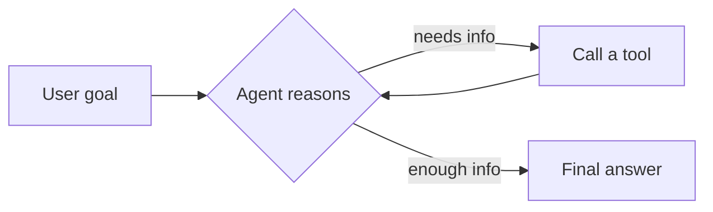

Everything up to this point in the roadmap — prompting, RAG, MCP — has been about getting a single, well-formed response out of a model. An **agent** is what you get when you stop asking for one response and start letting the model decide what to do next, repeatedly, until a goal is met.

## Chatbot vs Agent

A chatbot answers the message it was given. An agent is given a *goal*, and decides for itself which tools to call, in what order, and when it has enough information to stop.



That loop — reason, act, observe, repeat — is the core mechanic behind every agent framework you'll see for the rest of this roadmap, whether it's LangGraph, CrewAI, or a hand-rolled `while` loop around an LLM call.

## The Minimum Viable Agent

You don't need a framework to build one. An agent is just three things: a model with tool access, a loop, and a stopping condition.

```python
def run_agent(goal: str, tools: dict, max_steps: int = 8) -> str:
    messages = [{"role": "user", "content": goal}]
    for _ in range(max_steps):
        response = llm.chat(messages, tools=list(tools.values()))
        if response.tool_calls:
            for call in response.tool_calls:
                result = tools[call.name](**call.arguments)
                messages.append({"role": "tool", "content": str(result)})
        else:
            return response.content
    return "Gave up after max_steps without a final answer."
```

Every production agent framework is an elaboration on this: better memory, better error recovery, better observability — but the loop is the same.

## Why Agents Are Harder Than They Look

Three properties make agents fundamentally different from single-turn LLM calls:

- **Compounding error** — a 90%-accurate model making 10 sequential decisions succeeds end-to-end only ~35% of the time
- **Unbounded cost** — a bad stopping condition can burn thousands of tokens looping on a task it can't solve
- **Non-determinism** — the same goal can take a different path, call different tools, and reach a different answer on two separate runs

Every post for the rest of this month works through one piece of taming that: planning, memory, guardrails, and evaluation.

## When to Use an Agent (and When Not To)

| Use a single LLM call when... | Use an agent when... |
|---|---|
| The task is one well-defined transformation | The task requires multiple, dependent steps |
| You know the tools needed in advance | The right tool depends on intermediate results |
| Latency and cost predictability matter most | Correctness matters more than speed |
| A human reviews every output anyway | The system needs to act autonomously |

If you can hardcode the sequence of steps, hardcode it — a deterministic pipeline is cheaper, faster, and easier to debug than an agent that reasons its way to the same sequence every time.

## Where This Series Goes

Over the next week, we'll build up the pieces of a real agent one at a time: the ReAct reasoning loop, planning and task decomposition, memory, multi-agent coordination, guardrails, and evaluation — ending with a complete research agent built from scratch in Python.

---

*Part of the [AI Agents series]({{ site.baseurl }}/tags/agents-series/) — following the structure from [roadmap.sh/ai-engineer](https://roadmap.sh/ai-engineer).*
