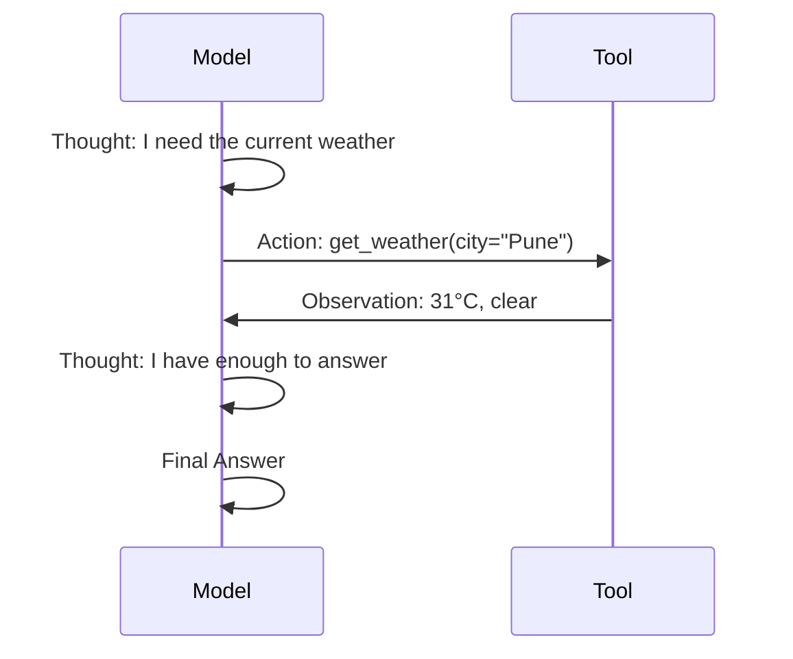

We touched on ReAct back in the [prompt engineering series]({{ site.baseurl }}/tags/roadmap/) as a reasoning technique. As an agent architecture, it's the default pattern almost every framework builds on, so it's worth a proper, standalone look.

## The Pattern

ReAct — **Rea**son + **Act** — interleaves the model's reasoning with tool calls, and feeds the tool's output back in as an observation before the next reasoning step.



The critical difference from a plain function-calling loop is that the model is *prompted to narrate its reasoning* before each action. That narration isn't just for humans reading the trace — it measurably improves tool-selection accuracy, because it forces the model to commit to a plan before acting instead of pattern-matching straight to a tool call.

## A Minimal ReAct Prompt

```text
Answer the question by reasoning step by step. At each step, output either:

Thought: <your reasoning>
Action: <tool_name>(<arguments>)

or, when you have enough information:

Thought: <your reasoning>
Final Answer: <answer>

You have access to: search(query), calculator(expression), get_weather(city)
```

Most modern models don't need this spelled out in the system prompt anymore — native function calling APIs handle the action-formatting for you. What you still need to prompt for explicitly is the *thought* step, since the API won't insert that on its own.

## Where ReAct Breaks Down

- **Long horizons** — after 15-20 steps, models tend to lose track of the original goal buried at the top of the context
- **Irrecoverable actions** — ReAct has no built-in concept of "this action can't be undone," so it'll happily retry a failed payment call the same way it retries a failed search
- **No look-ahead** — each step is decided greedily, one at a time, with no planning for what comes after — which is exactly the gap tomorrow's post on task decomposition addresses

## Observation Formatting Matters More Than You'd Think

The single highest-leverage change you can make to a ReAct agent's reliability is how you format tool outputs before feeding them back in. A raw JSON dump of a 200-row database result will blow your context and bury the one field the model needed.

```python
def format_observation(tool_name: str, result) -> str:
    if tool_name == "search" and isinstance(result, list):
        return "\n".join(f"- {r['title']}: {r['snippet']}" for r in result[:5])
    if isinstance(result, (dict, list)):
        return json.dumps(result, indent=2)[:2000]
    return str(result)[:2000]
```

Truncate, summarize, and structure every observation before it goes back into the context — never pass a raw API response straight through.

---

*Part of the [AI Agents series]({{ site.baseurl }}/tags/agents-series/) — building on [what AI agents are]({{ site.baseurl }}/posts/what-are-ai-agents/).*
