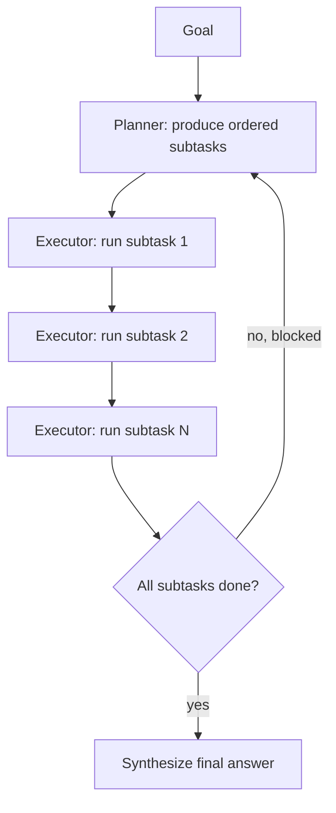

Pure ReAct decides one step at a time with no view of the whole task. For anything beyond a handful of steps, that greediness causes agents to wander — chasing a locally reasonable action that leads nowhere useful. Planning fixes this by having the model commit to a decomposition *before* execution starts.

## Plan-and-Execute

The simplest fix is to split reasoning into two phases: produce a plan, then execute it one step at a time, replanning only when a step fails or reveals new information.



```python
def plan(goal: str) -> list[str]:
    resp = llm.chat([{
        "role": "user",
        "content": f"Break this goal into 3-6 ordered, independent subtasks:\n{goal}\n"
                    f"Return a JSON list of short subtask descriptions."
    }])
    return json.loads(resp.content)

def execute_plan(goal: str, subtasks: list[str]) -> str:
    results = []
    for task in subtasks:
        results.append(run_agent(task, tools))
    return synthesize(goal, results)
```

## Decomposition Heuristics That Work

- **Independent before dependent** — plan subtasks that can run without needing each other's output first; it makes parallelization and partial-failure recovery much simpler
- **Bound subtask scope** — "research competitor pricing" is a subtask; "build the company" is not. If a subtask still needs its own multi-step reasoning, decompose again
- **Keep the plan visible** — re-inject the full plan and current progress into context at every step so the model doesn't lose the thread on long executions

## When to Replan

Rigid plans break the moment reality doesn't match assumptions. A subtask that returns "no results found" shouldn't be retried verbatim — it should trigger a replan:

```python
def execute_subtask(task: str, context: dict) -> str:
    result = run_agent(task, tools)
    if looks_like_failure(result):
        new_plan = replan(original_goal, completed=context["done"], failed=task, reason=result)
        return execute_plan(original_goal, new_plan)
    return result
```

A good rule of thumb: replan after any subtask failure, but cap total replans (2-3) so the agent can't loop forever trying to find a plan that works.

## Hierarchical Task Networks vs Flat Plans

For genuinely complex goals, a flat list of subtasks isn't enough — subtasks themselves need subtasks. This is where hierarchical planning comes in: a top-level planner produces coarse subtasks, and each subtask gets its own planner invocation before execution, recursively, down to leaf actions a single tool call can satisfy. It's more expensive per goal, but it scales to tasks that would otherwise exceed any single context window's ability to hold "everything left to do."

---

*Part of the [AI Agents series]({{ site.baseurl }}/tags/agents-series/) — continuing from [the ReAct loop]({{ site.baseurl }}/posts/react-agent-loop/).*
