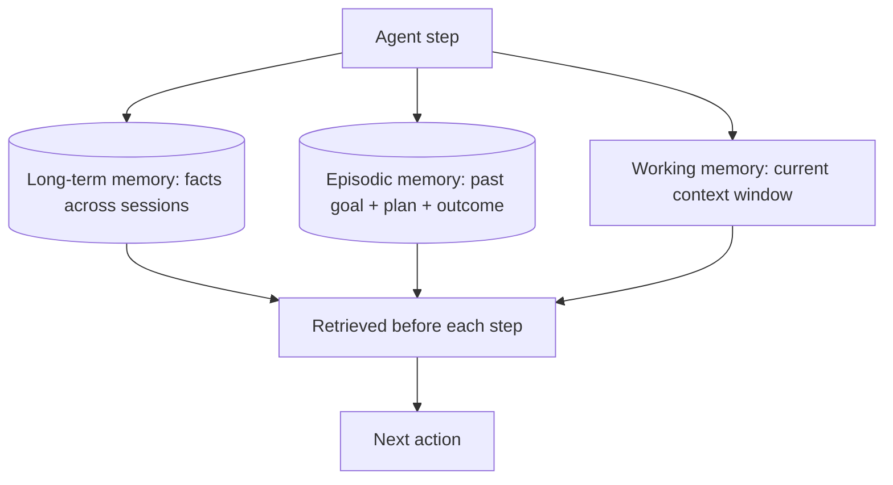

An agent without memory forgets everything the moment its context window fills up or the session ends. Real agents need three distinct kinds of memory, and conflating them is the most common design mistake.



Each memory type answers a different question — what's happening right now, what's true in general, and what worked last time — and an agent typically draws on all three before deciding its next action. The sections below cover each in turn.

## Working Memory: The Context Window Itself

This is the cheapest and most limited form of memory — whatever's currently in the prompt. It holds the current plan, recent tool observations, and the conversation so far. It disappears the instant the session ends, and it's bounded by the model's context limit, so long-running agents need a strategy for what to keep and what to drop.

```python
def trim_working_memory(messages: list[dict], max_tokens: int = 6000) -> list[dict]:
    # Always keep the system prompt and the original goal
    kept = messages[:2]
    remaining = count_tokens(kept)
    for msg in reversed(messages[2:]):
        t = count_tokens([msg])
        if remaining + t > max_tokens:
            break
        kept.insert(2, msg)
        remaining += t
    return kept
```

## Long-Term Memory: A Vector Store Across Sessions

Long-term memory persists facts across sessions — user preferences, past decisions, prior task outcomes. It's implemented the same way RAG retrieval is: embed a memory, store it, retrieve the top-k relevant memories before each agent step.

```python
def remember(text: str, metadata: dict):
    embedding = embed(text)
    vector_store.upsert(id=uuid4(), vector=embedding, payload={"text": text, **metadata})

def recall(query: str, k: int = 5) -> list[str]:
    hits = vector_store.search(embed(query), top_k=k)
    return [h.payload["text"] for h in hits]
```

The design decision that matters most here is *what* gets written to long-term memory. Writing every tool call and observation turns memory into noise. Write summarized, salient facts — "user prefers concise answers," "the staging database credentials expired on 2026-03-20" — not raw transcripts.

## Episodic Memory: Learning from Past Runs

Episodic memory stores complete past *episodes* — a goal, the plan used, and whether it succeeded — so the agent can retrieve similar past attempts before planning a new one. This is what lets an agent get measurably better over time without any weight updates.

```python
def recall_similar_episodes(goal: str, k: int = 3) -> list[dict]:
    hits = episode_store.search(embed(goal), top_k=k)
    return [
        {"goal": h.payload["goal"], "plan": h.payload["plan"], "outcome": h.payload["outcome"]}
        for h in hits
    ]
```

Feed the retrieved episodes into the planner prompt as few-shot examples: "Here's how a similar goal was solved last time, and whether it worked."

## Memory Hygiene

Unbounded memory writes are a slow-motion failure mode — retrieval quality degrades as the store fills with stale or contradictory facts. Three practices keep it usable:

- **Expire** — attach a TTL or a "last confirmed" timestamp to volatile facts
- **Deduplicate** — check for near-duplicate memories before writing a new one
- **Let the agent forget on request** — a user should be able to say "forget that" and have it actually removed, not just deprioritized

---

*Part of the [AI Agents series]({{ site.baseurl }}/tags/agents-series/) — memory design builds directly on the [RAG chunking]({{ site.baseurl }}/posts/rag-chunking-strategies/) and [vector database]({{ site.baseurl }}/posts/vector-database-comparison-faiss-qdrant-chromadb/) posts from earlier in the roadmap.*
