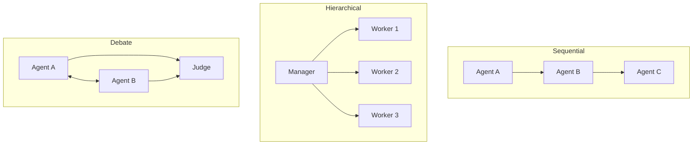

A single agent with one system prompt and a large toolbelt tends to get worse, not better, as you add more tools — it starts picking the wrong one, or misses better options buried in a long list. Multi-agent systems fix this by giving each agent a narrow role and a small, focused toolset, then coordinating between them.

## Three Coordination Patterns



**Sequential (pipeline)** — each agent's output feeds the next, like an assembly line. A research agent gathers facts, a writing agent drafts, an editing agent revises. Simple, predictable, but fully rigid — one bad step propagates unchecked.

**Hierarchical (manager-worker)** — a manager agent decomposes the goal and delegates subtasks to specialist workers, then synthesizes their results. This is the pattern CrewAI and AutoGen both default to, because it maps cleanly onto how human teams work.

**Debate/critique** — two or more agents propose and critique each other's answers, with a judge (often a third agent) picking or synthesizing the final one. Expensive, but measurably improves accuracy on tasks where a single pass is prone to a specific class of error.

## A Minimal Manager-Worker Implementation

```python
def manager_agent(goal: str, workers: dict[str, callable]) -> str:
    subtasks = plan(goal)  # from yesterday's decomposition step
    results = {}
    for subtask in subtasks:
        worker_name = route_to_worker(subtask, list(workers.keys()))
        results[subtask] = workers[worker_name](subtask)
    return synthesize(goal, results)

def route_to_worker(subtask: str, worker_names: list[str]) -> str:
    resp = llm.chat([{
        "role": "user",
        "content": f"Which worker should handle this: '{subtask}'? Options: {worker_names}. Respond with just the name."
    }])
    return resp.content.strip()
```

Each `worker` here is itself a full agent — its own system prompt, its own tools, its own memory scope. The manager never sees the worker's internal reasoning, only its final output, which keeps the manager's own context small.

## Communication: Shared State vs Message Passing

Two ways agents can share information:

- **Shared state** — all agents read and write to a common blackboard (a dict, a database row, a shared document). Simple, but race conditions and stale reads become real problems once agents run concurrently.
- **Message passing** — agents only communicate through explicit messages sent to each other, with no shared mutable state. Slower to wire up, but far easier to reason about, log, and replay.

Default to message passing unless you have a specific reason not to — it's what makes multi-agent traces debuggable, which matters enormously once something goes wrong in production.

## The Cost of Coordination

Every extra agent in the loop adds LLM calls, latency, and a new place for miscommunication to introduce errors. Before reaching for multi-agent, check whether a single agent with a better-organized toolset and a clearer system prompt solves the problem — coordination overhead is real, and it compounds with every agent you add.

---

*Part of the [AI Agents series]({{ site.baseurl }}/tags/agents-series/) — coordination patterns here carry forward directly into next month's [Agentic Frameworks series]({{ site.baseurl }}/tags/agentic-frameworks-series/).*
