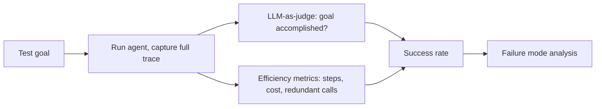

RAG evaluation asks "was the retrieved context relevant and was the answer faithful to it." Agent evaluation asks a harder question: across a whole multi-step trajectory, did the agent accomplish the goal, and did it do so efficiently and safely? A single output-quality score can't answer that.



Because the path an agent takes varies run to run, grading has to look at the outcome of the whole trajectory — not just a single output — which is why success rate, efficiency, and failure-mode analysis all sit downstream of the same trace. The sections below break down each piece.

## Task Success Rate: The Core Metric

The most important number for any agent is simple: out of N attempts at a representative set of goals, how many finished with a correct, complete outcome?

```python
def evaluate_agent(test_cases: list[dict]) -> dict:
    results = {"passed": 0, "failed": 0, "total_steps": 0, "total_cost": 0.0}
    for case in test_cases:
        trace = run_agent(case["goal"], tools, return_trace=True)
        success = judge_success(case["goal"], case["expected"], trace.final_answer)
        results["passed" if success else "failed"] += 1
        results["total_steps"] += len(trace.steps)
        results["total_cost"] += trace.cost
    results["success_rate"] = results["passed"] / len(test_cases)
    return results
```

Build this test set from real failure reports and real user goals, not synthetic ones — agent failure modes are specific to your tools and your users' phrasing, and a generic benchmark won't surface them.

## Efficiency Metrics Beyond Pass/Fail

Two agents can both succeed at a goal while one took 3 steps and the other took 15. Track:

- **Steps to completion** — fewer is better, assuming quality holds
- **Redundant tool calls** — the same tool called with near-identical arguments more than once in a trace
- **Cost per successful task** — total tokens/dollars spent, amortized only over successes

## Grading a Multi-Step Trace

Because the path to a correct answer varies run to run, grading needs to check the *outcome*, not the exact path taken. An LLM-as-judge works well here, given the goal and the final state:

```python
def judge_success(goal: str, expected: str, actual_answer: str) -> bool:
    resp = llm.chat([{
        "role": "user",
        "content": f"Goal: {goal}\nExpected outcome: {expected}\nActual final answer: {actual_answer}\n"
                    f"Did the agent accomplish the goal? Answer only yes or no."
    }], temperature=0)
    return resp.content.strip().lower().startswith("y")
```

For agents with side effects (a booking made, a record updated), check the actual state change, not just the text response — the agent can claim success in its final message while the underlying action silently failed.

## Common Agent Failure Modes to Test For

- **Premature stopping** — the agent gives up and returns a partial answer as if it were complete
- **Tool misuse** — calling a tool with plausible-looking but incorrect arguments
- **Context loss** — forgetting the original goal's constraints by step 10
- **Confident wrongness** — completing the loop cleanly while arriving at the wrong outcome, which is far more dangerous than an agent that visibly fails

A good agent eval suite has dedicated test cases targeting each of these, not just "does it work" cases — the point is to catch the specific ways your agent breaks, before your users do.

---

*Part of the [AI Agents series]({{ site.baseurl }}/tags/agents-series/) — everything from this week comes together tomorrow in [a complete research agent built end-to-end]({{ site.baseurl }}/posts/building-research-agent-python/).*
