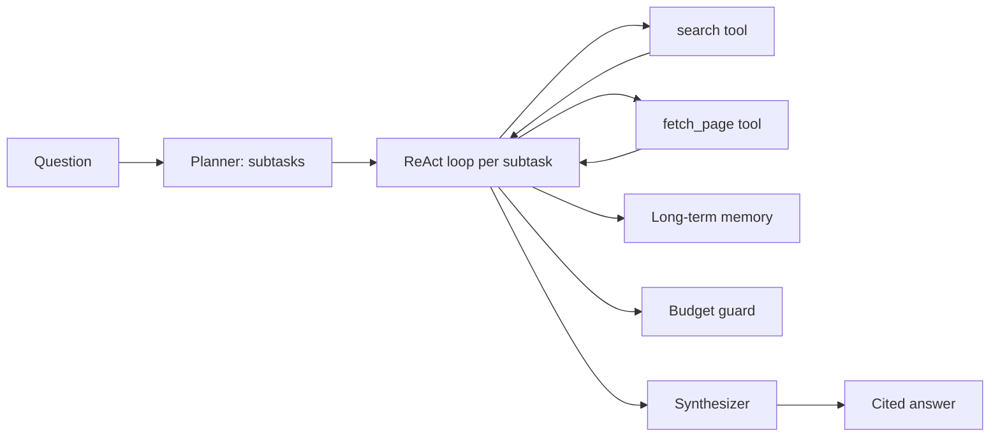

This closes out the AI Agents series by wiring together everything from this week — the ReAct loop, planning, memory, guardrails, and evaluation — into one working research agent: give it a question, it searches, reads, and synthesizes a cited answer.

## Architecture



## The Tools

```python
def search(query: str) -> list[dict]:
    results = search_api.query(query, num_results=5)
    return [{"title": r.title, "url": r.url, "snippet": r.snippet} for r in results]

def fetch_page(url: str) -> str:
    text = http_get_and_extract_text(url)
    return text[:4000]  # keep observations bounded

tools = {"search": search, "fetch_page": fetch_page}
```

## The Loop, With Guardrails and Memory Wired In

```python
def research_agent(question: str) -> dict:
    budget = AgentBudget(max_steps=12, max_cost_usd=0.75)
    memory = recall(question, k=3)  # prior research on similar questions
    subtasks = plan(question)

    findings = []
    for subtask in subtasks:
        messages = [{
            "role": "system",
            "content": "You are a research assistant. Use search and fetch_page. "
                       "Cite the URL for every fact you use."
        }]
        if memory:
            messages.append({"role": "system", "content": f"Relevant prior findings: {memory}"})
        messages.append({"role": "user", "content": subtask})

        for _ in range(4):
            resp = llm.chat(messages, tools=[search, fetch_page])
            if not resp.tool_calls:
                findings.append(resp.content)
                break
            for call in resp.tool_calls:
                budget.check(step_cost=0.02)
                result = tools[call.name](**call.arguments)
                messages.append({"role": "tool", "content": format_observation(call.name, result)})

    answer = synthesize_with_citations(question, findings)
    remember(f"Q: {question}\nA: {answer}", metadata={"type": "research"})
    return {"answer": answer, "sources": extract_citations(findings)}
```

## Synthesis With Citations

The synthesis step is a plain, non-agentic LLM call — no tools, just a summarization prompt over the gathered findings, instructed to keep every citation attached to its claim:

```python
def synthesize_with_citations(question: str, findings: list[str]) -> str:
    resp = llm.chat([{
        "role": "user",
        "content": f"Question: {question}\n\nFindings:\n{chr(10).join(findings)}\n\n"
                    f"Write a concise, well-cited answer. Every factual claim needs a [source] marker."
    }])
    return resp.content
```

## Running the Eval Suite Against It

Before shipping, run it through the eval harness from yesterday's post against a set of 15-20 representative questions, checking success rate, average steps, and cost per query. If success rate is below your bar, the fix is almost never "use a bigger model" first — check the search tool's result quality, the subtask decomposition, and the observation formatting before reaching for a different model.

## What's Next

April moves from hand-rolled agent loops like this one into the frameworks built to manage this complexity at scale — LangGraph, CrewAI, AutoGen, and the Claude and OpenAI agent SDKs — starting with LangGraph's stateful graph model.

---

*Part of the [AI Agents series]({{ site.baseurl }}/tags/agents-series/) — the final post in this mini-series, and the foundation for the [Agentic Frameworks series]({{ site.baseurl }}/tags/agentic-frameworks-series/) starting tomorrow.*
