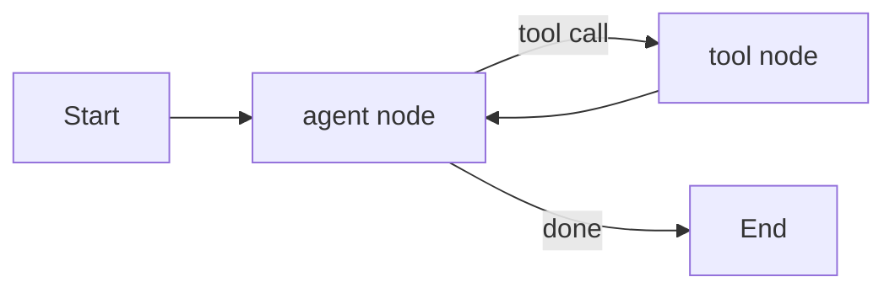

Everything we hand-built in March — the loop, the plan, the memory, the budget checks — is exactly what LangGraph gives you as a library. It models an agent as a **graph**: nodes are steps (an LLM call, a tool call, a check), edges are transitions, and a shared **state** object flows through every node.

## Why a Graph Instead of a Loop

A plain `while` loop works until you need branches, retries, or parallel paths — then the control flow turns into a tangle of `if`s. A graph makes that structure explicit and inspectable.



## Defining State and Nodes

```python
from typing import TypedDict, Annotated
from langgraph.graph import StateGraph, END
import operator

class AgentState(TypedDict):
    messages: Annotated[list, operator.add]
    steps: int

def agent_node(state: AgentState) -> AgentState:
    response = llm.chat(state["messages"])
    return {"messages": [response], "steps": state["steps"] + 1}

def tool_node(state: AgentState) -> AgentState:
    last = state["messages"][-1]
    results = [run_tool(c) for c in last.tool_calls]
    return {"messages": results, "steps": state["steps"]}
```

`Annotated[list, operator.add]` tells LangGraph *how* to merge a node's output into the existing state — here, append new messages rather than overwrite them. Getting this reducer right is the single most common source of bugs in a first LangGraph build.

## Wiring the Graph

```python
graph = StateGraph(AgentState)
graph.add_node("agent", agent_node)
graph.add_node("tools", tool_node)
graph.set_entry_point("agent")

def should_continue(state: AgentState) -> str:
    last = state["messages"][-1]
    if last.tool_calls and state["steps"] < 10:
        return "tools"
    return END

graph.add_conditional_edges("agent", should_continue, {"tools": "tools", END: END})
graph.add_edge("tools", "agent")

app = graph.compile()
result = app.invoke({"messages": [{"role": "user", "content": "Research the top 3 vector databases."}], "steps": 0})
```

That `add_conditional_edges` call is the graph's decision point — replacing the `if resp.tool_calls:` branch from our hand-rolled loop with something LangGraph can visualize, checkpoint, and resume.

## What You Get for Free

- **Checkpointing** — persist state after every node, so a crashed run can resume exactly where it left off instead of restarting
- **Visualization** — `app.get_graph().draw_mermaid()` renders the exact diagram above from your actual code, which is invaluable once graphs grow past a handful of nodes
- **Streaming** — `app.stream(...)` yields state updates as each node completes, so a UI can show progress in real time

## When LangGraph Is Worth the Learning Curve

For a single linear agent, LangGraph is arguably overkill — the hand-rolled loop from March is simpler and has fewer moving parts to learn. It earns its complexity once you have branches, need to pause for human approval mid-run, or need durable state across process restarts — which is exactly what tomorrow's post on cycles and human-in-the-loop covers.

---

*Part of the [Agentic Frameworks series]({{ site.baseurl }}/tags/agentic-frameworks-series/) — following on from March's [AI Agents fundamentals]({{ site.baseurl }}/tags/agents-series/).*
