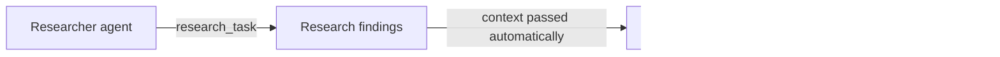

Where LangGraph models an agent system as a graph of arbitrary nodes, CrewAI models it as a team: **agents** with roles and personalities, **tasks** they're assigned, and a **crew** that runs them in a defined process. It trades some of LangGraph's flexibility for a much faster path to a working multi-agent system.



`Process.sequential` is CrewAI's simplest coordination pattern: each task runs in order, and `context=[research_task]` wires the researcher's output straight into the writer's prompt without any manual state passing. Later sections cover the role/goal/backstory fields that shape each agent and how this compares to LangGraph's more explicit graph.

## Defining Agents by Role

```python
from crewai import Agent, Task, Crew, Process

researcher = Agent(
    role="Senior Research Analyst",
    goal="Find accurate, current information on the given topic",
    backstory="You're meticulous about sourcing and never state a fact without a citation.",
    tools=[search_tool, fetch_page_tool],
    verbose=True,
)

writer = Agent(
    role="Technical Writer",
    goal="Turn research findings into a clear, well-structured summary",
    backstory="You write for engineers who want substance, not filler.",
    tools=[],
)
```

The `role`, `goal`, and `backstory` fields aren't just documentation — they get compiled directly into each agent's system prompt. A vague backstory produces a vague agent; be as specific here as you would writing a system prompt by hand.

## Defining Tasks

```python
research_task = Task(
    description="Research the current state of {topic}. Find at least 3 credible sources.",
    expected_output="A bulleted list of findings, each with a source URL.",
    agent=researcher,
)

writing_task = Task(
    description="Using the research findings, write a 300-word summary of {topic}.",
    expected_output="A well-structured, cited summary.",
    agent=writer,
    context=[research_task],  # writer receives the researcher's output
)
```

`context=[research_task]` is how CrewAI wires data flow between agents — the writer's prompt automatically includes the researcher's output, without you manually passing state around.

## Running the Crew

```python
crew = Crew(
    agents=[researcher, writer],
    tasks=[research_task, writing_task],
    process=Process.sequential,
)

result = crew.kickoff(inputs={"topic": "on-device LLM inference"})
print(result.raw)
```

`Process.sequential` runs tasks in the order listed, each one waiting for the last. It's the CrewAI equivalent of yesterday's LangGraph pipeline pattern, with far less boilerplate — at the cost of less control over exactly what happens between steps.

## CrewAI vs LangGraph: When to Reach for Which

| | CrewAI | LangGraph |
|---|---|---|
| Mental model | Team of role-based agents | Graph of arbitrary steps |
| Setup speed | Fast — minutes to a working crew | Slower — more to configure |
| Control | Coarse — process types, task ordering | Fine — every edge and node explicit |
| Best for | Role-shaped problems (research → write → review) | Anything with complex branching, loops, or human-in-the-loop |

If your problem naturally decomposes into roles a human team would recognize, start with CrewAI. If you need precise control over branching, retries, or durable interruption, LangGraph is worth the extra setup.

---

*Part of the [Agentic Frameworks series]({{ site.baseurl }}/tags/agentic-frameworks-series/) — tomorrow: [CrewAI's hierarchical process]({{ site.baseurl }}/posts/crewai-hierarchical-process-delegation/), where a manager agent delegates dynamically instead of following a fixed sequence.*
