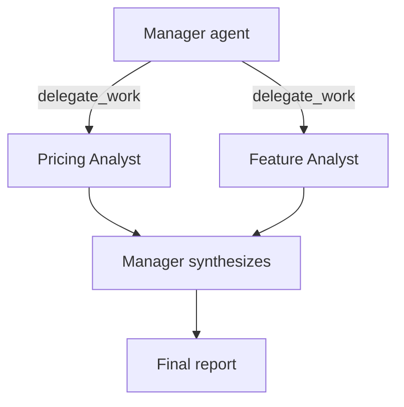

Yesterday's crew ran a fixed sequence of tasks. `Process.hierarchical` replaces that fixed order with a manager agent that decides, at runtime, which worker handles which piece of work — the CrewAI equivalent of the manager-worker pattern from March's multi-agent post.



Unlike yesterday's fixed sequence, nothing in your code decides which worker gets which piece — the manager reads the task at runtime and calls `delegate_work` itself, which trades predictability for flexibility. The rest of this post covers what the manager does under the hood and when that trade-off is worth it.

## Setting Up a Hierarchical Crew

```python
from crewai import Agent, Task, Crew, Process

pricing_analyst = Agent(role="Pricing Analyst", goal="Analyze competitor pricing", tools=[search_tool])
feature_analyst = Agent(role="Feature Analyst", goal="Analyze competitor feature sets", tools=[search_tool])
writer = Agent(role="Report Writer", goal="Synthesize analyst findings into a report")

competitive_analysis = Task(
    description="Produce a competitive analysis of {competitors} covering pricing and features.",
    expected_output="A structured report with pricing and feature comparison sections.",
    agent=None,  # no fixed agent — the manager assigns this
)

crew = Crew(
    agents=[pricing_analyst, feature_analyst, writer],
    tasks=[competitive_analysis],
    process=Process.hierarchical,
    manager_llm="claude-sonnet-5",
)

result = crew.kickoff(inputs={"competitors": "Qdrant, Pinecone, Weaviate"})
```

Leaving `agent=None` on the task and setting `process=Process.hierarchical` hands control to an automatically-created manager agent, which reads the task description, decides which of the three workers should handle which piece, and delegates.

## What the Manager Actually Does

Under the hood, the manager is itself an LLM-driven agent with two built-in tools: `delegate_work` and `ask_question`. It calls `delegate_work` to hand a sub-piece of the task to a named agent, waits for the result, and repeats until it judges the overall task complete — then synthesizes the final output itself.

```python
# Roughly what the manager's tool call looks like internally:
{
  "tool": "delegate_work",
  "arguments": {
    "task": "Research current pricing for Qdrant, Pinecone, and Weaviate",
    "agent": "Pricing Analyst",
  }
}
```

This is more flexible than a fixed sequence — the manager can delegate the same subtask to multiple agents in parallel, or skip an agent entirely if the task doesn't need it — but it's also less predictable, since the exact delegation pattern isn't fixed in your code.

## Delegation Between Peer Agents

Workers can also delegate to each other directly, without going through a manager, by setting `allow_delegation=True`:

```python
researcher = Agent(role="Researcher", goal="...", allow_delegation=True)
```

An agent with delegation enabled gets its own `delegate_work` tool, letting it hand off a subtask to a specific peer mid-execution — useful when one agent realizes partway through that a different specialist is better suited to a piece of its own task.

## Sequential vs Hierarchical: A Practical Rule

Use `Process.sequential` when you can specify the exact order of work up front — most well-scoped pipelines fit this. Reach for `Process.hierarchical` only when the right task breakdown genuinely depends on what earlier steps discover — it costs an extra LLM call per delegation decision, and that overhead isn't worth paying for work you could have just ordered explicitly.

---

*Part of the [Agentic Frameworks series]({{ site.baseurl }}/tags/agentic-frameworks-series/) — next: [AutoGen's conversation-first take]({{ site.baseurl }}/posts/autogen-multi-agent-conversations/) on the same coordination problem.*
