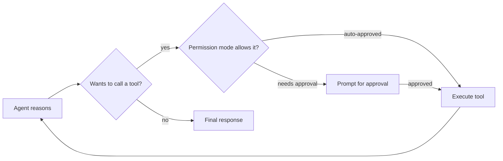

The Claude Agent SDK packages the same agentic loop pattern that powers Claude Code — a model with file, bash, and search tools, running in a permissioned execution loop — into a library you can build your own agents on top of.



Permissioning is the piece that distinguishes this from a bare function-calling loop — every tool call passes through a policy check before it runs, which is what makes it safe to hand the agent tools with real side effects. Subagents and hooks, covered below, build on the same loop.

## The Core Loop

```python
from claude_agent_sdk import ClaudeAgent, tool

@tool
def query_database(sql: str) -> str:
    """Run a read-only SQL query against the analytics database."""
    return run_readonly_query(sql)

agent = ClaudeAgent(
    model="claude-sonnet-5",
    system_prompt="You are a data analyst. Use query_database to answer questions.",
    tools=[query_database],
    permission_mode="acceptEdits",
)

result = agent.run("What were the top 5 products by revenue last quarter?")
```

The `@tool` decorator pulls the tool's name, description, and argument schema straight from the function signature and docstring — matching the pattern Claude Code itself uses internally for its own built-in tools.

## Permission Modes

The SDK's permission system is what separates it from a bare function-calling loop: every tool call can be gated by policy before it executes.

```python
agent = ClaudeAgent(
    model="claude-sonnet-5",
    tools=[query_database, send_report_email],
    permission_mode="default",  # prompts before "risky" tools
    allowed_tools=["query_database"],  # auto-approved, no prompt
)
```

`permission_mode="dontAsk"` auto-approves every tool call — useful for a sandboxed batch job with no human present, dangerous for anything with side effects reaching outside the sandbox. `permission_mode="plan"` has the agent propose an approach and wait for approval before executing anything, mirroring how Claude Code's plan mode works.

## Subagents

The SDK supports spawning scoped subagents for well-defined subtasks, each with its own tool access and context, without polluting the parent agent's conversation:

```python
research_result = agent.spawn_subagent(
    task="Research current pricing for our top 3 competitors",
    tools=[web_search],
    max_turns=10,
)
```

This mirrors the manager-worker pattern from March, but with the SDK managing context isolation for you — the subagent's tool-call noise never enters the parent's context window, only its final result does.

## Hooks for Custom Control

Hooks let you intercept the loop at defined points — before a tool runs, after a response streams, when the session ends — without forking the SDK's internals:

```python
def audit_tool_call(tool_name: str, arguments: dict) -> None:
    log_to_audit_trail(tool_name, arguments, timestamp=now())

agent = ClaudeAgent(model="claude-sonnet-5", tools=[...], hooks={"pre_tool_use": audit_tool_call})
```

## Choosing Between Agent SDKs

The Claude Agent SDK, the OpenAI Agents SDK, and LangGraph all converge on the same underlying loop, but differ in what they optimize for: the Claude SDK optimizes for coding-agent-style workflows with strong built-in permissioning; OpenAI's optimizes for clean multi-agent handoffs; LangGraph optimizes for arbitrary graph control. Pick based on which shape matches your actual workflow, not brand preference — all three can express the same agent, with different amounts of code.

---

*Part of the [Agentic Frameworks series]({{ site.baseurl }}/tags/agentic-frameworks-series/) — next: a different paradigm entirely, [DSPy's programmatic approach]({{ site.baseurl }}/posts/dspy-programming-not-prompting/) to working with language models.*
