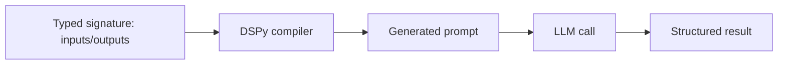

Every framework so far has you write prompts by hand — system messages, few-shot examples, careful phrasing — and tune them manually when quality slips. DSPy takes a different position: define *what* each step should accomplish as a typed signature, and let DSPy compile the actual prompt text for you, then optimize it automatically against your metric.



Where every other framework in this series has you hand-write the prompt string, DSPy generates it from the signature and can rewrite it automatically — the compiler step is what tomorrow's post on optimizers builds on.

## Signatures Instead of Prompts

```python
import dspy

class AnswerWithSources(dspy.Signature):
    """Answer the question using only the provided context, and cite sources."""
    context: str = dspy.InputField()
    question: str = dspy.InputField()
    answer: str = dspy.OutputField(desc="a concise, cited answer")

qa = dspy.ChainOfThought(AnswerWithSources)
result = qa(context=retrieved_context, question="What's the tradeoff between LoRA and full fine-tuning?")
print(result.answer)
```

Notice there's no prompt string anywhere in this code. `dspy.ChainOfThought` takes the signature and generates a working prompt behind the scenes — including the reasoning-step instruction you'd otherwise write by hand, as covered back in the chain-of-thought post.

## Composing Signatures into Pipelines

DSPy programs are plain Python — signatures compose the same way functions do:

```python
class RAGPipeline(dspy.Module):
    def __init__(self):
        self.retrieve = dspy.Retrieve(k=5)
        self.generate = dspy.ChainOfThought(AnswerWithSources)

    def forward(self, question):
        passages = self.retrieve(question).passages
        return self.generate(context="\n".join(passages), question=question)

pipeline = RAGPipeline()
```

This is a full RAG pipeline with no hand-written prompt text — retrieval and generation are both declared as typed steps, and DSPy's compiler is responsible for turning them into API calls.

## Why This Matters More Than It Sounds

The practical payoff isn't stylistic — it's that a DSPy program can be *optimized automatically*. Tomorrow's post covers DSPy's optimizers in depth, but the short version: give the pipeline a metric and a handful of labeled examples, and DSPy searches for a better prompt (and better few-shot examples) than most engineers would hand-tune to, in minutes rather than days of manual iteration.

## The Tradeoff: Less Direct Control

The cost of this abstraction is that you're no longer looking at, or directly editing, the actual prompt sent to the model — DSPy generates and can rewrite it. For teams used to hand-crafting every word of a system prompt, that's a real adjustment. In practice, you can always inspect the compiled prompt (`dspy.inspect_history()`), but you're meant to iterate on the signature and the metric, not the prompt text itself.

## When to Reach for DSPy

DSPy earns its complexity when you have a measurable metric and enough labeled examples to optimize against — a few dozen is often enough to start. For a one-off prompt with no clear success metric, hand-writing it is still faster. DSPy is at its best for pipelines you'll run at scale and want to keep improving without manual prompt archaeology every time the underlying model changes.

---

*Part of the [Agentic Frameworks series]({{ site.baseurl }}/tags/agentic-frameworks-series/) — continues with [DSPy's optimizers]({{ site.baseurl }}/posts/dspy-optimizers-improving-prompts/) in detail.*
