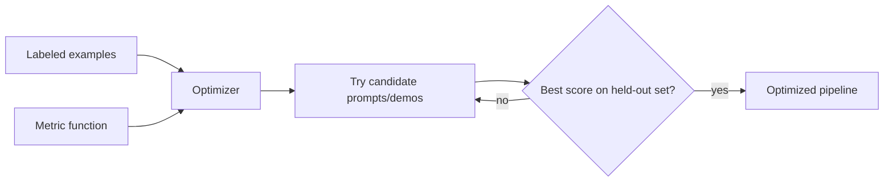

Yesterday's DSPy pipeline worked, but its prompt was whatever DSPy generated by default from the signature — not necessarily a good one. Optimizers are how you turn a handful of labeled examples and a metric into a measurably better program.



The optimizer's search loop is the whole point of DSPy: it tries combinations of instructions and few-shot demos, scores each against your metric, and keeps the best — the same kind of search a human would do by hand, just automated and validated against held-out data.

## Defining a Metric

An optimizer needs a way to score outputs. This can be exact-match, or an LLM-as-judge, or anything in between:

```python
def answer_quality_metric(example, prediction, trace=None) -> float:
    return 1.0 if is_factually_consistent(prediction.answer, example.context) else 0.0
```

## Running an Optimizer

```python
from dspy.teleprompt import BootstrapFewShotWithRandomSearch

optimizer = BootstrapFewShotWithRandomSearch(
    metric=answer_quality_metric,
    max_bootstrapped_demos=4,
    num_candidate_programs=10,
)

optimized_pipeline = optimizer.compile(RAGPipeline(), trainset=labeled_examples)
```

What happens inside `compile`: DSPy runs the base pipeline over your training examples, keeps the ones that score well as few-shot demonstrations, tries several candidate combinations of demos and instruction phrasing, and returns whichever version scored highest against your metric — all without you writing a single prompt variant by hand.

## MIPRO: Optimizing Instructions, Not Just Examples

Bootstrap-based optimizers mainly select good few-shot examples. `MIPROv2` goes further, using an LLM to propose and test *instruction text* variations too:

```python
from dspy.teleprompt import MIPROv2

optimizer = MIPROv2(metric=answer_quality_metric, auto="medium")
optimized_pipeline = optimizer.compile(RAGPipeline(), trainset=labeled_examples, valset=held_out_examples)
```

This is closer to a small hyperparameter search than manual prompt engineering — it explores a space of instruction phrasings and demo sets and picks the combination that generalizes best to the held-out validation set, not just the training set.

## Inspecting What Got Optimized

```python
optimized_pipeline.save("optimized_rag.json")
print(optimized_pipeline.generate.demos)  # the few-shot examples it selected
dspy.inspect_history(n=1)  # the actual compiled prompt sent to the model
```

Always inspect the result. Automatic optimization can overfit to quirks in a small training set the same way any optimizer can — a held-out validation set isn't optional, it's how you catch that before it ships.

## Optimizers vs Fine-Tuning

DSPy optimizers change *what you send to the model* — prompts and examples — not the model's weights. That makes them dramatically cheaper and faster to iterate on than fine-tuning, and a good first thing to try before reaching for the fine-tuning techniques covered next month. They also compose: a DSPy-optimized prompt against a fine-tuned model is a completely valid, often best-of-both, combination.

---

*Part of the [Agentic Frameworks series]({{ site.baseurl }}/tags/agentic-frameworks-series/) — next: [Semantic Kernel]({{ site.baseurl }}/posts/semantic-kernel-enterprise-agents/) for enterprise .NET and Python agent development.*
