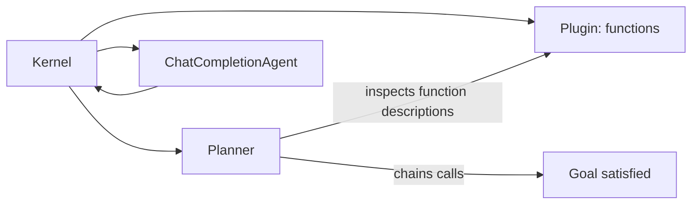

Semantic Kernel is Microsoft's agent framework, and its defining trait is being genuinely first-class in both .NET and Python — which matters a lot if your organization's existing systems are built on C#/.NET rather than the Python-first tooling most of this series has covered.



The kernel is the shared registry every plugin and agent attaches to, and the planner is what turns registered functions into a sequence of calls automatically — similar in spirit to the ReAct loop, but scoped to functions you've explicitly registered rather than open-ended tool use.

## Kernels, Plugins, and Functions

The kernel is the central object every plugin and function attaches to:

```python
from semantic_kernel import Kernel
from semantic_kernel.functions import kernel_function

class InventoryPlugin:
    @kernel_function(description="Check current stock level for a SKU")
    def check_stock(self, sku: str) -> str:
        return get_stock_level(sku)

kernel = Kernel()
kernel.add_plugin(InventoryPlugin(), plugin_name="inventory")
```

A "plugin" is a related group of functions — conceptually similar to how MCP groups tools under a server, and not a coincidence: Semantic Kernel added native MCP client support, letting you import an MCP server's tools directly as a plugin.

## Planners: Automatic Function Composition

Where CrewAI's manager picks agents and LangGraph's edges are hand-defined, Semantic Kernel's planner decides which sequence of *functions* to call to satisfy a goal:

```python
from semantic_kernel.planners import FunctionCallingStepwisePlanner

planner = FunctionCallingStepwisePlanner(service_id="chat")
result = await planner.invoke(kernel, "Check stock for SKU-4471 and reorder if below 10 units.")
```

The planner inspects every registered function's description and parameters, then chains calls automatically — similar in spirit to a ReAct loop, but scoped specifically to composing registered kernel functions rather than open-ended tool use.

## Agents Built on Kernels

```python
from semantic_kernel.agents import ChatCompletionAgent

inventory_agent = ChatCompletionAgent(
    kernel=kernel,
    name="InventoryAgent",
    instructions="Manage inventory levels and reorder when stock is low.",
)

response = await inventory_agent.get_response(messages="Is SKU-4471 low on stock?")
```

Agents in Semantic Kernel are a thin layer over the kernel and its registered plugins — the framework's real strength is the plugin/function ecosystem underneath, not a novel agent abstraction on top.

## Enterprise-Specific Features

What sets Semantic Kernel apart from the Python-native frameworks in this series is enterprise integration depth: native connectors for Azure AI Search, Azure OpenAI, Microsoft Graph, and enterprise identity (Entra ID) baked in, plus telemetry hooks that plug directly into Application Insights — relevant if your organization is already standardized on the Azure stack, less relevant otherwise.

## When to Choose Semantic Kernel

Pick it when your team is already invested in .NET, Azure, or Microsoft's enterprise identity and observability stack — the integration cost savings there are real. For a greenfield Python project with no Microsoft-stack dependencies, LangGraph or the Claude/OpenAI SDKs are generally faster to get productive in, with a larger community and more third-party integrations.

---

*Part of the [Agentic Frameworks series]({{ site.baseurl }}/tags/agentic-frameworks-series/) — next: [LlamaIndex agents]({{ site.baseurl }}/posts/llamaindex-agents-data-aware-tool-use/), built around data-aware retrieval.*
