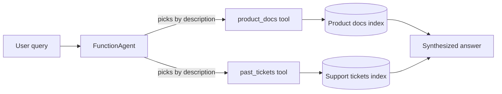

LlamaIndex started as a data-indexing library for RAG, and its agent layer inherits that focus: instead of a general-purpose graph or role framework, it's built around treating retrieval indexes themselves as first-class tools an agent can query.



Each "tool" here isn't a plain function — it's a full retrieval pipeline with its own chunking, embedding, and reranking, and the agent routes to the right one purely from its description, the same way it would pick between any two function tools.

## Query Engines as Tools

The core idea: a LlamaIndex query engine (an index over a document set, wrapped with retrieval-and-synthesis logic) can be handed to an agent exactly like any other function tool.

```python
from llama_index.core import VectorStoreIndex
from llama_index.core.tools import QueryEngineTool
from llama_index.core.agent.workflow import FunctionAgent

product_docs_index = VectorStoreIndex.from_documents(product_docs)
support_tickets_index = VectorStoreIndex.from_documents(past_tickets)

product_tool = QueryEngineTool.from_defaults(
    query_engine=product_docs_index.as_query_engine(),
    name="product_docs",
    description="Answers questions about product features and configuration.",
)
tickets_tool = QueryEngineTool.from_defaults(
    query_engine=support_tickets_index.as_query_engine(),
    name="past_tickets",
    description="Searches previously resolved support tickets for similar issues.",
)

agent = FunctionAgent(tools=[product_tool, tickets_tool], llm=llm)
response = await agent.run("A customer's SSO login is failing after our last release.")
```

The agent decides which index to query based on each tool's description, exactly like it would decide between any two function tools — the difference is that each "tool" here is itself a retrieval pipeline with its own chunking, embedding, and reranking configuration underneath.

## Multi-Document Agents

For a knowledge base spanning many distinct document sets, LlamaIndex supports building one query-engine tool per document collection and routing between them automatically, rather than dumping everything into a single index:

```python
tools = [
    QueryEngineTool.from_defaults(query_engine=idx.as_query_engine(), name=name, description=desc)
    for name, idx, desc in document_collections
]
agent = FunctionAgent(tools=tools, llm=llm)
```

This tends to outperform one giant merged index once a knowledge base spans genuinely distinct domains — routing to the right narrow index first, then retrieving within it, beats retrieving across everything at once and hoping the reranker sorts it out.

## Workflows: LlamaIndex's Answer to Graphs

For control flow beyond a single agent loop, LlamaIndex's `Workflow` API is its equivalent of LangGraph — steps defined as event-driven functions, wired together by the events they emit and consume:

```python
from llama_index.core.workflow import Workflow, step, StartEvent, StopEvent

class ResearchWorkflow(Workflow):
    @step
    async def retrieve(self, ev: StartEvent) -> RetrievalDoneEvent:
        docs = await product_docs_index.aretrieve(ev.query)
        return RetrievalDoneEvent(docs=docs)

    @step
    async def synthesize(self, ev: RetrievalDoneEvent) -> StopEvent:
        answer = await llm.acomplete(build_prompt(ev.docs))
        return StopEvent(result=answer)
```

## When LlamaIndex Is the Right Default

If your agent's core job is answering questions over your own data — documents, tickets, structured records — LlamaIndex's retrieval-first tooling will get you further, faster, than building the same retrieval plumbing yourself under LangGraph or CrewAI. For agents whose primary job is *acting* rather than *retrieving*, one of the other frameworks in this series is usually a better fit.

---

*Part of the [Agentic Frameworks series]({{ site.baseurl }}/tags/agentic-frameworks-series/) — next: a cross-cutting concern every framework here depends on — [designing tool schemas agents can actually use well]({{ site.baseurl }}/posts/custom-tool-schemas-agents/).*
