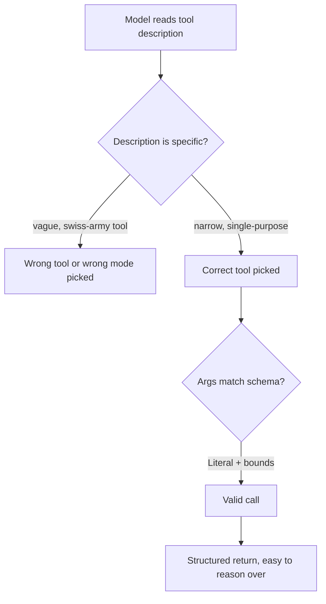

Every framework this month hands you a way to register a tool. None of them stop you from registering a *badly designed* one — and a badly designed tool is the single most common reason a working framework still produces an unreliable agent.



Nearly every tool-selection failure traces back to one of these forks — a vague description, an overloaded `action` parameter, or an unconstrained argument schema. The sections below fix each one.

## Descriptions Are Prompts, Not Documentation

A tool's `description` field goes directly into the model's context at every step. Treat it like prompt engineering, not like a docstring for other engineers.

```python
# Weak — describes the implementation, not when to use it
def search(query: str) -> list:
    """Searches the index."""

# Strong — tells the model exactly when this tool applies
def search_product_catalog(query: str) -> list:
    """Search the product catalog by name, category, or feature keywords.
    Use this for questions about what products exist or their specifications.
    Do NOT use this for order status or account questions — use those tools instead."""
```

That last negative instruction matters more than it looks — explicitly ruling out adjacent uses cuts down on the single most common tool-selection error: picking a plausible-sounding tool for a task it wasn't meant for.

## Narrow, Single-Purpose Tools Beat Swiss-Army-Knife Ones

```python
# Avoid: one tool, many unrelated modes
def manage_order(action: str, order_id: str, **kwargs) -> dict: ...

# Prefer: separate tools per action
def get_order_status(order_id: str) -> dict: ...
def cancel_order(order_id: str, reason: str) -> dict: ...
def update_shipping_address(order_id: str, address: dict) -> dict: ...
```

An `action` parameter that silently switches behavior forces the model to get two things right at once — which action, and which arguments are valid for it — and doubles the ways a call can go subtly wrong. Splitting into separate tools turns that into one decision per call.

## Argument Schemas: Constrain What You Can

```python
from pydantic import BaseModel, Field
from typing import Literal

class RefundRequest(BaseModel):
    order_id: str = Field(description="The order ID, format ORD-XXXXX")
    reason: Literal["defective", "wrong_item", "changed_mind", "other"]
    amount_cents: int = Field(gt=0, le=100000)
```

`Literal` and numeric bounds do double duty: they constrain what the model can even attempt to pass, and most SDKs surface these constraints to the model as part of the tool schema — so the model sees the valid options directly, rather than guessing at free text and getting it wrong.

## Return Values: Structure Beats Prose

A tool that returns a paragraph of prose forces the model to re-parse it on every subsequent step. Return structured data and let the model's own reasoning turn it into prose only in the final answer:

```python
def get_weather(city: str) -> dict:
    return {"city": city, "temp_c": 22, "condition": "clear", "as_of": now_iso()}
```

## Testing Tools in Isolation Before Wiring Up an Agent

Before handing a new tool to an agent, call it directly with a handful of representative arguments and check the output is what you'd expect a model to be able to reason over correctly. A surprising fraction of "the agent is dumb" bug reports turn out to be "the tool returns something the agent could never have used correctly" — fix the tool, not the prompt, first.

---

*Part of the [Agentic Frameworks series]({{ site.baseurl }}/tags/agentic-frameworks-series/) — next: [human-in-the-loop patterns]({{ site.baseurl }}/posts/human-in-the-loop-agentic-workflows/) across every framework covered so far.*
