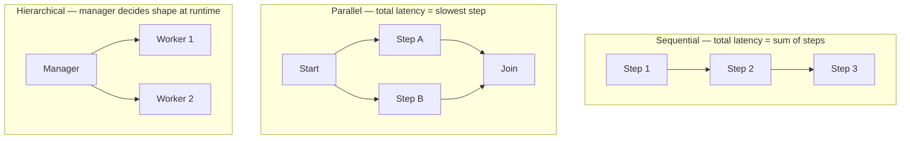

Every framework this month expresses the same three underlying orchestration shapes with different syntax. Stepping back from any one framework, it's worth being explicit about when each shape is the right call.



## Sequential: Default Until Proven Otherwise

If step 2 needs step 1's output, it has to be sequential — there's no framework trick around a genuine data dependency. Most task decompositions have more sequential dependencies than people initially assume; verify independence before assuming you can parallelize.

## Parallel: The Free Latency Win

When two subtasks are genuinely independent, running them concurrently is close to free — no extra LLM calls, just wall-clock time saved:

```python
import asyncio

async def parallel_research(topics: list[str]) -> list[str]:
    tasks = [research_agent.arun(topic) for topic in topics]
    return await asyncio.gather(*tasks)
```

The catch: rate limits and cost. Ten parallel branches means ten times the concurrent API load — check your provider's concurrency limits before fanning out, and add a semaphore if needed:

```python
semaphore = asyncio.Semaphore(4)

async def bounded_research(topic: str) -> str:
    async with semaphore:
        return await research_agent.arun(topic)
```

## Hierarchical: When the Shape Isn't Known Until Runtime

Sequential and parallel both require you to know the task graph in advance. Hierarchical (manager-worker) orchestration is worth its overhead specifically when the right decomposition depends on what earlier subtasks discover — a manager that can adapt at each step beats a fixed pipeline that can't.

## A Decision Framework

```python
def choose_orchestration(task_graph_known: bool, subtasks_independent: bool) -> str:
    if not task_graph_known:
        return "hierarchical"
    if subtasks_independent:
        return "parallel"
    return "sequential"
```

In practice, most production agent systems combine all three: a hierarchical manager decomposes the goal, dispatches independent subtasks in parallel, and each subtask itself runs as a small sequential pipeline. Don't pick one pattern globally — pick per layer of the system.

## The Metric That Actually Matters

Whichever shape you choose, measure total wall-clock latency and total cost against the naive fully-sequential baseline. It's easy to add parallelism that saves no real time because the bottleneck was actually rate limits, not step count — always verify the assumed win with a measurement, not just the architecture diagram.

---

*Part of the [Agentic Frameworks series]({{ site.baseurl }}/tags/agentic-frameworks-series/) — next: [state management]({{ site.baseurl }}/posts/state-management-long-running-workflows/) for workflows that outlive a single process.*
