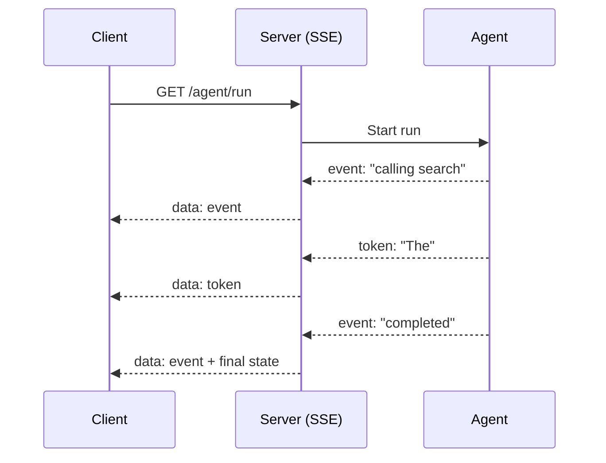

A multi-step agent that takes 30 seconds and shows nothing until the end feels broken, even when it isn't. Streaming intermediate state — the current step, tool calls as they happen, tokens as they generate — is what makes a slow agent feel responsive.



Tokens, structural events, and full state snapshots are three different things worth streaming, and mixing them up is the most common mistake — each has its own place in the payload, covered below.

## What to Stream, Not Just How

There are three distinct things worth streaming, and conflating them is the most common mistake:

- **Tokens** — the raw text of a response, as it's generated
- **Events** — structural updates: "started step 2," "calling search," "step 3 complete"
- **State snapshots** — the full current state, sent periodically for a client that reconnects

```python
async def stream_agent_run(goal: str):
    yield {"type": "event", "data": "started"}
    async for step in agent.astream(goal):
        if step["type"] == "tool_call":
            yield {"type": "event", "data": f"calling {step['tool_name']}"}
        elif step["type"] == "token":
            yield {"type": "token", "data": step["content"]}
        elif step["type"] == "final":
            yield {"type": "event", "data": "completed"}
            yield {"type": "state", "data": step["full_state"]}
```

## Server-Sent Events with FastAPI

SSE is the simplest transport for this — one-directional, works over plain HTTP, and every browser supports it natively:

```python
from fastapi import FastAPI
from fastapi.responses import StreamingResponse
import json

app = FastAPI()

@app.get("/agent/run")
async def run_agent_endpoint(goal: str):
    async def event_generator():
        async for event in stream_agent_run(goal):
            yield f"data: {json.dumps(event)}\n\n"
    return StreamingResponse(event_generator(), media_type="text/event-stream")
```

This builds directly on the FastAPI streaming patterns from the [LLM engineering series]({{ site.baseurl }}/posts/llm-fastapi-patterns/) — an agent's event stream is just a richer version of the token stream covered there.

## WebSockets When You Need Bidirectional

SSE can't carry a mid-run human approval or a "cancel this run" signal back to the server — for that, WebSockets are the right tool, at the cost of more connection-management complexity:

```python
@app.websocket("/agent/ws")
async def agent_websocket(websocket: WebSocket):
    await websocket.accept()
    goal = await websocket.receive_text()
    async for event in stream_agent_run(goal):
        await websocket.send_json(event)
        if event["type"] == "event" and event["data"] == "needs_approval":
            approval = await websocket.receive_json()
            handle_approval(approval)
```

## Reconnection and Missed Events

A client that drops mid-stream and reconnects needs to catch up, not just resume receiving new events blindly. Attach an incrementing sequence number to every event and let the client request "everything after sequence N" on reconnect, backed by the same checkpoint store from yesterday's post.

## The UX Payoff

A well-instrumented stream lets a UI show a live step list, a progress indicator scaled to expected step count, and partial results as they're produced — turning a 30-second black box into something that feels like watching work happen, which measurably improves perceived reliability even when the underlying latency hasn't changed at all.

---

*Part of the [Agentic Frameworks series]({{ site.baseurl }}/tags/agentic-frameworks-series/) — next: [testing agentic workflows]({{ site.baseurl }}/posts/testing-agentic-workflows-flaky-assertions/) without flaky, non-deterministic assertions.*
