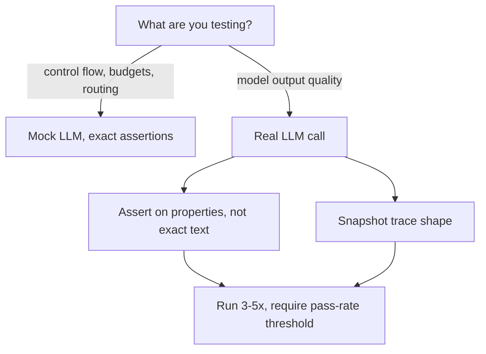

`assert result == "The capital of France is Paris."` breaks the moment the model phrases things slightly differently, even when the answer is correct. Testing non-deterministic agent output needs a different toolkit than testing deterministic code.



Deterministic parts of an agent get exact-match tests against a mocked model; anything touching real model output needs looser, property-based assertions run multiple times, since a single pass or fail isn't a reliable signal for non-deterministic generation.

## Layer Your Tests: Mock the Model, Test the Logic

Not every test needs a real LLM call. Test the deterministic parts of your agent — routing logic, budget enforcement, state transitions — against a mocked model that returns fixed responses:

```python
class MockLLM:
    def __init__(self, responses: list[dict]):
        self.responses = responses
        self.call_count = 0

    def chat(self, messages, tools=None):
        response = self.responses[self.call_count]
        self.call_count += 1
        return response

def test_budget_stops_after_max_steps():
    mock = MockLLM([{"tool_calls": [{"name": "search", "arguments": {"q": "x"}}]}] * 20)
    with pytest.raises(BudgetExceeded):
        run_agent("goal", tools, llm=mock, max_steps=5)
```

This test runs in milliseconds, costs nothing, and is completely deterministic — because it's testing your loop's control flow, not the model's reasoning quality.

## Testing Model Behavior: Assertions That Tolerate Variation

For the parts that genuinely need a real model call, assert on properties of the output, not exact text:

```python
def test_agent_cites_sources():
    result = research_agent.run("What is retrieval-augmented generation?")
    assert len(result.sources) >= 1
    assert all(s.startswith("http") for s in result.sources)
    assert "retrieval" in result.answer.lower()

def test_agent_refuses_out_of_scope_request():
    result = support_agent.run("Write me a poem about clouds.")
    assert_semantically_similar(
        result.answer,
        "I can only help with product support questions.",
        threshold=0.75,
    )
```

`assert_semantically_similar` embeds both strings and checks cosine similarity above a threshold — tolerant of phrasing differences, strict about meaning.

## Snapshot Testing Agent Traces

For catching regressions in *behavior*, not just final output, snapshot the full trace and diff structurally — which tools got called, in what order, not the exact reasoning text:

```python
def test_research_agent_trace_shape():
    trace = research_agent.run("Compare Qdrant and Pinecone", return_trace=True)
    tool_sequence = [step.tool_name for step in trace.steps if step.type == "tool_call"]
    assert tool_sequence[0] == "search"
    assert "fetch_page" in tool_sequence
```

## Flakiness Budget: Run Multiple Times, Not Once

Because model output varies run to run, a single pass/fail isn't a reliable signal. For anything in CI, run the same test case 3-5 times and require a pass rate above a threshold, not 100% every time:

```python
def test_with_pass_rate(test_fn, runs=5, min_pass_rate=0.8):
    passes = sum(1 for _ in range(runs) if test_fn())
    assert passes / runs >= min_pass_rate
```

Set `temperature=0` for tests where you genuinely want determinism, and accept variation everywhere else rather than fighting it with brittle exact-match assertions.

---

*Part of the [Agentic Frameworks series]({{ site.baseurl }}/tags/agentic-frameworks-series/) — next: [debugging agents]({{ site.baseurl }}/posts/debugging-agents-tracing-tool-calls/) when a test like this fails and you need to know why.*
