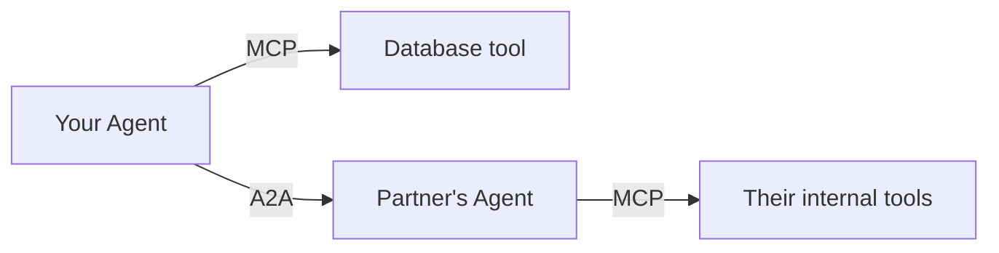

MCP standardized how an agent talks to *tools*. A2A addresses a different gap: how does an agent built by your team talk to an agent built by another team, possibly running on entirely different infrastructure, without both sides agreeing on a shared framework?

## MCP vs A2A: Different Layers



MCP is agent-to-tool: give a model structured access to a capability. A2A is agent-to-agent: let one autonomous agent delegate a task to another autonomous agent it doesn't control internals of, treating it as a peer rather than a tool.

## The Core A2A Concepts

An A2A-compliant agent publishes an **agent card** — a discoverable description of what it can do, similar in spirit to an OpenAPI spec:

```json
{
  "name": "Travel Booking Agent",
  "description": "Books flights and hotels given constraints",
  "capabilities": ["flight_search", "hotel_search", "booking"],
  "endpoint": "https://partner.example.com/a2a"
}
```

A client agent discovers the agent card, then sends a **task** — a structured goal, not a raw prompt — and receives back either a result or a request for clarification:

```python
def delegate_task(agent_card: dict, task: dict) -> dict:
    response = requests.post(agent_card["endpoint"], json={
        "task_id": str(uuid4()),
        "input": task,
        "expected_output_schema": task.get("schema"),
    })
    return response.json()
```

## Why This Matters More As Agents Proliferate

A2A becomes relevant the moment your organization has more than one team building agents, or you need to integrate with a vendor's agent rather than their plain API. Without a shared protocol, every integration becomes a bespoke, undocumented contract — exactly the problem MCP solved for tools, one layer up.

## Task States and Long-Running Delegation

A2A tasks can be long-running — a partner agent might take minutes to complete a booking, not milliseconds. The protocol defines explicit task states (`submitted`, `working`, `input-required`, `completed`, `failed`) so a client agent can poll or subscribe to updates rather than blocking on a single HTTP call, the same durable-execution concern from this month's state management post, now crossing an organizational boundary.

## Security Considerations Specific to A2A

Delegating a task to an external agent means trusting it with whatever context you send — treat an A2A endpoint with the same scrutiny you'd give any third-party API: scope what data goes in the task payload, validate what comes back before acting on it, and never delegate an irreversible action to an agent you don't control without a human checkpoint on your side of the boundary.

---

*Part of the [Agentic Frameworks series]({{ site.baseurl }}/tags/agentic-frameworks-series/) — next: [retrieval-augmented agents]({{ site.baseurl }}/posts/retrieval-augmented-agents-rag-and-tools/), combining this spring's RAG series with everything covered on agents since.*
