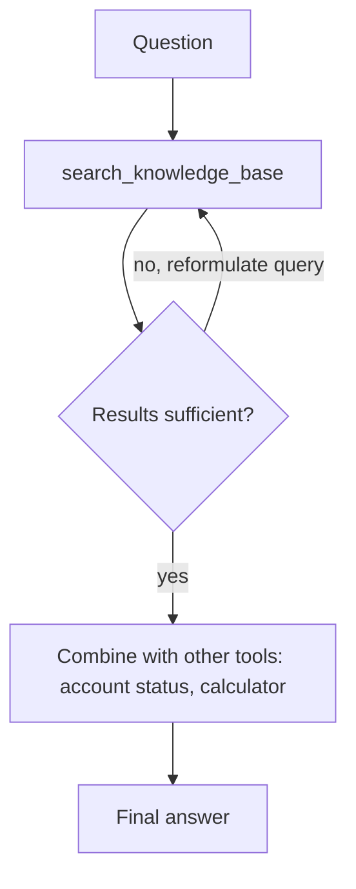

March's RAG series built pipelines that retrieve once and generate once. Real questions often need *iterative* retrieval — search, notice the results are insufficient, refine the query, search again — which is exactly what treating retrieval as an agent tool unlocks instead of a fixed pipeline step.



A fixed RAG pipeline retrieves once against one index and stops; an agent can loop back with a reformulated query, or chain retrieval with live system checks, until the question is actually answerable. The rest of this post covers reformulation and the prompt-injection risk of treating retrieved text as trusted.

## Retrieval as a Tool, Not a Pipeline Stage

```python
def search_knowledge_base(query: str, k: int = 5) -> list[dict]:
    """Search the internal knowledge base. Call again with a refined query
    if the results don't answer the question."""
    hits = vector_store.search(embed(query), top_k=k)
    return [{"text": h.payload["text"], "source": h.payload["source"], "score": h.score} for h in hits]

agent = build_agent(tools=[search_knowledge_base, calculator, get_current_date])
```

The description explicitly tells the model it's allowed to re-query — a single-shot RAG pipeline can't do that, but an agent with retrieval as a tool can decide, based on the first batch of results, that it needs to search again with different terms.

## Query Reformulation as an Explicit Step

Left alone, models often reuse the user's original phrasing verbatim on a second search, hitting the same weak results. Prompting for explicit reformulation fixes this:

```python
system_prompt = """When search results don't fully answer the question, don't give up —
reformulate the query using different terms or a narrower scope, and search again.
Try at most 3 searches before answering with what you have."""
```

## Combining Retrieval with Other Tools in One Loop

The real power of this pattern is mixing retrieval with action tools in the same loop — retrieve a policy document, then check a live system against it:

```python
tools = [search_knowledge_base, get_account_status, calculate_refund_amount]
result = agent.run("Is this customer eligible for a refund under our current policy?")
# Model retrieves the refund policy, retrieves account status, reasons over both, then calculates
```

A fixed RAG pipeline can't express this — it retrieves once against one index. An agent can chain retrieval from multiple sources with live system checks in whatever order the specific question requires.

## Guarding Against Retrieval-Triggered Prompt Injection

A retrieved document is untrusted content the moment it enters context — the same caution from MCP's tool-output handling applies here. A malicious or compromised document in your knowledge base could contain text designed to redirect the agent's next action. Never let retrieved text be interpreted as instructions; always frame it explicitly as reference material in the prompt structure, and this becomes especially important once agents pair retrieval with action tools that have real side effects.

## When Iterative Retrieval Is Overkill

If your knowledge base is small and well-organized enough that a single good retrieval reliably surfaces the right context, agentic retrieval adds latency and cost for no measurable quality gain — profile your actual failure rate on single-shot RAG before reaching for this pattern. It earns its keep on large, heterogeneous knowledge bases where the first query is often wrong.

---

*Part of the [Agentic Frameworks series]({{ site.baseurl }}/tags/agentic-frameworks-series/) — next: [code-generating agents]({{ site.baseurl }}/posts/code-generating-agents-sandboxing/) and the specific safety concerns of letting a model write and run its own code.*
