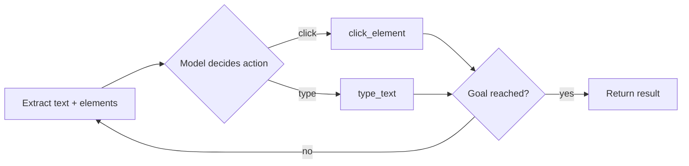

Some tasks don't have a clean API — filling out a legacy web form, checking a competitor's site for a price change, or navigating a portal that only exposes a UI. Browser-using agents give a model control of an actual browser instead of waiting for an API to exist.



This is the same ReAct-style perceive-then-act loop from earlier agent posts, just with browser-specific tools swapped in for the observation and action steps.

## The Toolset: Perceive, Then Act

A browser agent needs tools to see the page and tools to interact with it:

```python
from playwright.async_api import async_playwright

async def get_page_content(page) -> str:
    return await page.evaluate("() => document.body.innerText")

async def get_clickable_elements(page) -> list[dict]:
    elements = await page.query_selector_all("a, button, input")
    return [{"index": i, "text": await el.inner_text(), "tag": await el.evaluate("e => e.tagName")}
             for i, el in enumerate(elements)]

async def click_element(page, index: int, elements: list):
    await elements[index].click()

async def type_text(page, index: int, text: str, elements: list):
    await elements[index].fill(text)
```

Raw HTML is too noisy for a model's context — extract visible text and a numbered list of interactive elements instead, and have the model refer to elements by index rather than trying to construct CSS selectors itself.

## Screenshot-Grounded Navigation

For pages where structure alone doesn't convey enough (visual layouts, canvas-based UIs), pass a screenshot alongside the extracted text and let a vision-capable model reason over both:

```python
async def get_page_state(page) -> dict:
    screenshot = await page.screenshot()
    return {"text": await get_page_content(page), "screenshot": screenshot, "url": page.url}

result = agent.run(goal="Find the current price of the Pro plan", initial_state=await get_page_state(page))
```

## The Loop: Same ReAct Pattern, Different Tools

```python
async def browser_agent_loop(goal: str, page, max_steps: int = 15):
    for _ in range(max_steps):
        elements = await get_clickable_elements(page)
        state = await get_page_state(page)
        response = llm.chat([
            {"role": "system", "content": "Navigate the page to accomplish the goal. Use click_element or type_text."},
            {"role": "user", "content": f"Goal: {goal}\nPage: {state['text'][:2000]}\nElements: {elements}"},
        ], tools=[click_element, type_text])
        if response.is_final:
            return response.content
        await execute_tool_call(response.tool_calls[0], page, elements)
```

## Guardrails Specific to Browser Agents

- **Never auto-submit forms with payment or account-deletion consequences** — this is exactly the irreversible-action tier from March's guardrails post
- **Domain allowlists** — restrict which sites the agent can navigate to, especially for agents that follow links autonomously
- **CAPTCHA and bot-detection boundaries** — respect them; don't build automation specifically to evade a site's stated terms of service

## When to Use Browser Automation vs Building an Integration

Browser agents are inherently more fragile than an API integration — a site redesign breaks the agent's element-matching logic overnight. Use browser automation as a bridge for sites with no API, and prefer a proper API integration the moment one becomes available; the maintenance cost difference is substantial.

---

*Part of the [Agentic Frameworks series]({{ site.baseurl }}/tags/agentic-frameworks-series/) — next: [computer-use agents]({{ site.baseurl }}/posts/computer-use-agents-desktop-control/), extending this same idea beyond the browser to a full desktop.*
