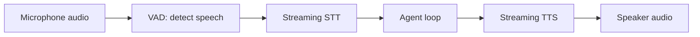

A voice agent is a normal agent loop wrapped in two more layers: speech-to-text on the way in, text-to-speech on the way out, both of which need to happen fast enough that a phone call doesn't feel like talking to a laggy chatbot.

## The Pipeline



Each arrow here is a latency budget line item. A voice conversation feels natural below roughly 800ms round-trip and starts feeling broken above about 1.5 seconds — which means every stage needs to stream, not batch.

## Streaming Every Stage

```python
async def voice_agent_turn(audio_stream):
    transcript_buffer = ""
    async for chunk in stt_client.stream_transcribe(audio_stream):
        transcript_buffer += chunk.text
        if chunk.is_final:
            break  # user finished speaking (per VAD)

    response_stream = agent.astream(transcript_buffer)
    async for token in response_stream:
        audio_chunk = await tts_client.stream_synthesize(token)
        await play_audio_chunk(audio_chunk)
```

Streaming TTS on partial token output, rather than waiting for the full response, is what shaves the most perceived latency — the user hears the first words while the model is still generating the rest.

## Turn-Taking: The Hard Problem

Text conversations have an explicit "send" button; voice conversations don't. Voice Activity Detection (VAD) has to infer when the user has actually finished speaking versus just pausing mid-sentence:

```python
def should_end_turn(vad_result, silence_duration_ms: float) -> bool:
    return (
        not vad_result.is_speech
        and silence_duration_ms > 700  # tuned per use case — too short cuts users off
    )
```

Production voice agents also need **interruption handling** — if the user starts speaking while the agent's TTS is still playing, the agent should stop talking and listen, not talk over them:

```python
async def handle_interruption(is_agent_speaking: bool, new_speech_detected: bool):
    if is_agent_speaking and new_speech_detected:
        await stop_tts_playback()
        await cancel_in_flight_generation()
```

## Choosing STT and TTS Providers

The comparison of Whisper, Deepgram, and AssemblyAI for speech-to-text, and the tradeoffs in natural-sounding TTS, get a full dedicated post in July's multimodal series — the short version for now: prioritize *streaming* support and low time-to-first-token/first-audio-chunk over raw transcription accuracy for real-time voice agents, since a highly accurate but slow transcription is worse for conversational feel than a slightly less accurate fast one.

## Fallback to Text When Voice Fails

Every production voice agent needs a graceful degrade path — if STT confidence is low or the pipeline errors, ask the user to repeat themselves or offer a text-based handoff rather than guessing at what they said and acting on a bad transcript.

---

*Part of the [Agentic Frameworks series]({{ site.baseurl }}/tags/agentic-frameworks-series/) — next, everything this month comes together in [a customer support agent that escalates correctly]({{ site.baseurl }}/posts/customer-support-agent-escalation/).*
