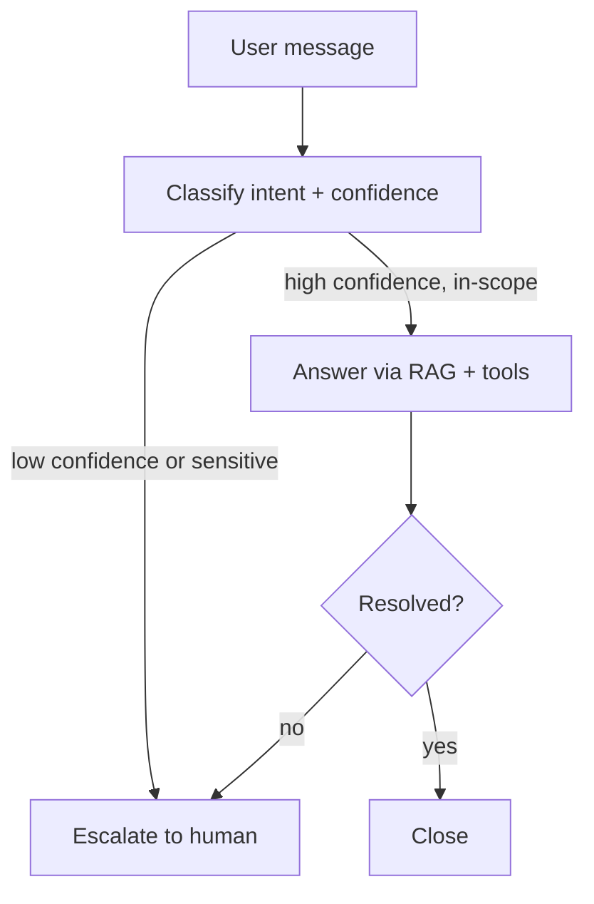

This is the month's first full worked example: a support agent that answers from documentation, checks account state through tools, and — the part most tutorials skip — knows when to hand off to a human instead of guessing.

## Architecture



## Intent Classification with Confidence

```python
def classify_intent(message: str) -> dict:
    resp = llm.chat([{
        "role": "user",
        "content": f"Classify this support message: '{message}'\n"
                    f"Return JSON: {{category, confidence (0-1), is_sensitive}}. "
                    f"Sensitive = billing disputes, account security, legal threats, or explicit anger."
    }], temperature=0)
    return json.loads(resp.content)
```

## The Escalation Gate

```python
ESCALATION_THRESHOLD = 0.7

def route_message(message: str) -> str:
    intent = classify_intent(message)
    if intent["is_sensitive"] or intent["confidence"] < ESCALATION_THRESHOLD:
        return escalate_to_human(message, reason=intent)
    return handle_with_agent(message, intent["category"])
```

Sensitivity overrides confidence entirely — a billing dispute classified with 95% confidence still escalates, because being *right* about the category isn't the same as being *appropriate* to auto-resolve.

## Handling the In-Scope Case

```python
support_agent = build_agent(
    tools=[search_knowledge_base, get_account_status, check_order_status],
    system_prompt="Answer using the knowledge base and account tools. "
                  "If you can't fully resolve the issue, say so and call escalate().",
)

def handle_with_agent(message: str, category: str) -> str:
    result = support_agent.run(message, context={"category": category})
    if result.called_escalate or not result.confident:
        return escalate_to_human(message, reason={"category": category, "agent_uncertain": True})
    return result.answer
```

The agent has its own `escalate()` tool available — self-escalation mid-conversation, not just a pre-check, catches cases where the issue only reveals its complexity after a tool call comes back with an unexpected result.

## Escalation Handoff Quality

A bad escalation dumps the raw chat log on a human agent and makes them start from scratch. A good one packages a summary:

```python
def escalate_to_human(message: str, reason: dict) -> str:
    ticket = create_ticket(
        summary=summarize_for_human(message, reason),
        category=reason.get("category"),
        priority="high" if reason.get("is_sensitive") else "normal",
        transcript=get_conversation_history(),
    )
    return f"I've escalated this to our support team (ticket #{ticket.id}). They'll follow up shortly."
```

## Measuring Whether the Gate Is Tuned Right

Track two rates: false escalations (a human resolves it trivially, meaning the agent should have handled it) and false auto-resolutions (a user has to come back because the agent's answer didn't actually work). Tune the confidence threshold against both — optimizing only for "fewer escalations" without watching the second number is how support agents earn a bad reputation fast.

---

*Part of the [Agentic Frameworks series]({{ site.baseurl }}/tags/agentic-frameworks-series/) — next: the same discipline applied to [a coding agent that reviews its own diffs]({{ site.baseurl }}/posts/coding-agent-reviews-own-diffs/).*
