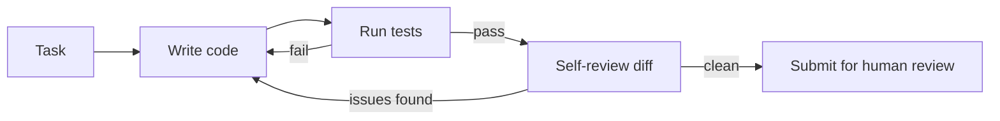

A coding agent that writes code and stops is only half-built. The version that catches its own bugs before a human ever sees the diff adds a self-review pass between "code written" and "code submitted" — cheap relative to the cost of a human reviewer catching the same issue later.

## Architecture



## Generating the Change

```python
def write_change(task: str, repo_context: str) -> str:
    resp = llm.chat([{
        "role": "user",
        "content": f"Repo context:\n{repo_context}\n\nTask: {task}\n\n"
                    f"Write the code change as a unified diff."
    }])
    return resp.content

def apply_and_test(diff: str) -> dict:
    apply_diff(diff)
    result = run_sandboxed(["pytest", "-x"], timeout=60)
    return {"passed": result.exit_code == 0, "output": result.stdout}
```

## The Self-Review Pass

The review step deliberately uses a *different* prompt framing than the one that wrote the code — reviewing your own work with the same mental frame that produced it catches far fewer bugs than reviewing with a fresh, adversarial lens:

```python
def self_review(diff: str, task: str) -> dict:
    resp = llm.chat([{
        "role": "user",
        "content": f"Review this diff as a skeptical senior engineer. Task it claims to solve: {task}\n\n{diff}\n\n"
                    f"Check specifically for: edge cases not handled, error handling gaps, "
                    f"tests that don't actually exercise the new logic, and security issues. "
                    f"Return JSON: {{issues: [...], severity: 'none'|'minor'|'blocking'}}."
    }], temperature=0.3)
    return json.loads(resp.content)
```

## The Fix-Review Loop

```python
def coding_agent(task: str, repo_context: str, max_rounds: int = 3) -> dict:
    diff = write_change(task, repo_context)
    for round_num in range(max_rounds):
        test_result = apply_and_test(diff)
        if not test_result["passed"]:
            diff = write_change(f"{task}\n\nFix this test failure:\n{test_result['output']}", repo_context)
            continue
        review = self_review(diff, task)
        if review["severity"] == "none":
            return {"diff": diff, "status": "ready_for_human_review"}
        diff = write_change(f"{task}\n\nAddress this review feedback:\n{review['issues']}", repo_context)
    return {"diff": diff, "status": "needs_human_attention", "reason": "max_rounds_exceeded"}
```

## What Self-Review Catches, and What It Doesn't

Self-review reliably catches missing edge cases, obvious error-handling gaps, and superficial test weaknesses. It's much less reliable at catching issues requiring context the agent didn't have — a subtle interaction with a part of the codebase it never looked at, or a business-logic requirement that was never stated. Self-review is a filter that reduces the volume and severity of issues a human reviewer sees; it doesn't replace human review for anything shipping to production.

## Guardrails on the Loop

Cap `max_rounds` and wrap the whole loop in the cost budget from earlier this month — a coding agent stuck oscillating between two failing states (fix breaks test A, fixing test A breaks test B) will otherwise burn tokens indefinitely without human intervention.

---

*Part of the [Agentic Frameworks series]({{ site.baseurl }}/tags/agentic-frameworks-series/) — next: stepping back to [compare every framework covered this month]({{ site.baseurl }}/posts/agent-frameworks-compared/) side by side.*
