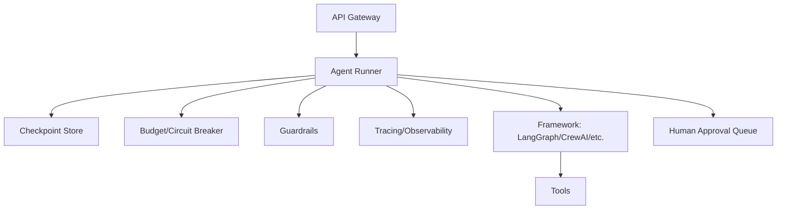

This closes out the Agentic Frameworks series by pulling every piece from the month into a single production deployment checklist — the gap between "the agent works on my machine" and "the agent is safe to run unattended for real users."

## The Production Agent Stack



## The Pre-Launch Checklist

- **Budgets at every layer** — per-run, per-user, org-wide, with a circuit breaker on spend spikes (April 20)
- **Human checkpoints on irreversible actions** — every tool that sends money, deletes data, or sends external communication (March 29, April 14)
- **Durable state** — a checkpoint store that survives process restarts, not just in-memory state (April 16)
- **Full tracing on every run** — not just failures, so you can debug the ones that "succeeded" incorrectly (April 19)
- **Loop and cost guards tested under adversarial input**, not just the happy path (March 29)
- **A tested escalation or fallback path** for every category of failure the eval suite surfaces (March 30, April 27)

## Rollout: Shadow, Then Canary, Then Full

Never flip an agent from "works in staging" straight to "handles all production traffic." Run it in shadow mode first — process real requests, log what it *would* do, take no real action — and compare its decisions against what actually happened or what a human would have done:

```python
def shadow_run(request):
    real_outcome = existing_system.handle(request)
    agent_outcome = agent.run(request, dry_run=True)
    log_comparison(request, real_outcome, agent_outcome)
    return real_outcome  # agent's decision is never actually applied yet
```

Once shadow metrics look solid, move to a canary — a small percentage of real traffic, real actions, tight monitoring, instant rollback capability — before a full rollout.

## Monitoring That Matters Post-Launch

Task success rate and cost per task from March's evaluation post aren't one-time benchmarks — they're production dashboards. Add alerting on regressions: a sudden drop in success rate, a spike in escalation rate, or cost per task drifting upward without a corresponding traffic change are all early signals worth paging on, not just quarterly review metrics.

## What's Next

May turns from *how agents act* to *how models themselves get better* — fine-tuning, from LoRA fundamentals through a complete fine-tuning project, covering when it's the right tool relative to everything built with prompting and retrieval so far.

---

*Part of the [Agentic Frameworks series]({{ site.baseurl }}/tags/agentic-frameworks-series/) — the final post in this series, leading into the [Fine-Tuning series]({{ site.baseurl }}/tags/fine-tuning-series/) starting tomorrow.*
