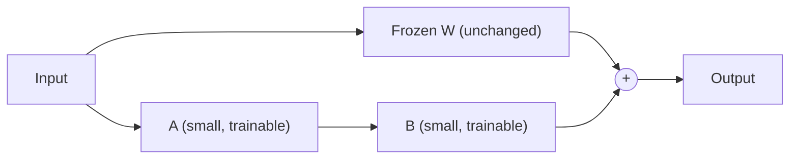

Full fine-tuning updates every weight in a model — for a 7B-parameter model, that's 7 billion numbers to store gradients and optimizer state for, which is why it needs serious GPU memory. LoRA (Low-Rank Adaptation) gets nearly the same behavioral change by training a tiny fraction of that.

## The Core Idea

Instead of updating a weight matrix `W` directly, LoRA freezes `W` entirely and learns two small matrices, `A` and `B`, whose product approximates the *change* you'd want to make to `W`:



```
h = Wx + BAx
```

`W` stays frozen. `A` and `B` are much smaller — if `W` is a 4096×4096 matrix, a rank-8 LoRA adds only two 4096×8 and 8×4096 matrices, roughly 0.4% of `W`'s parameter count.

## Why This Works as Well as It Does

The empirical finding behind LoRA is that the *update* needed to adapt a pretrained model to a new task is low-rank — it doesn't need the full expressiveness of a dense weight update to capture the behavioral shift you're after. This isn't true for training from scratch, but it holds well for adapting an already-capable pretrained model.

## Applying LoRA in Practice

```python
from peft import LoraConfig, get_peft_model
from transformers import AutoModelForCausalLM

model = AutoModelForCausalLM.from_pretrained("meta-llama/Llama-3-8b")

lora_config = LoraConfig(
    r=16,                    # rank — the key size/quality tradeoff knob
    lora_alpha=32,           # scaling factor, typically 2x the rank
    target_modules=["q_proj", "v_proj"],  # which weight matrices get adapted
    lora_dropout=0.05,
    task_type="CAUSAL_LM",
)

model = get_peft_model(model, lora_config)
model.print_trainable_parameters()
# trainable params: 4,194,304 || all params: 8,034,979,840 || trainable%: 0.052
```

## The Rank Tradeoff

Higher rank (`r`) means more trainable parameters and more capacity to capture complex behavioral changes, at higher training cost and higher risk of overfitting on a small dataset. Start at `r=8` or `r=16` for most tasks — go higher only if evaluation shows the model isn't capturing the target behavior with the smaller rank.

## Which Modules to Target

Targeting only attention projections (`q_proj`, `v_proj`) is the common default and captures most of the behavioral adaptation at minimal cost. Adding `k_proj`, `o_proj`, and the MLP layers increases capacity further, at a proportional training cost increase — reserve that for tasks where attention-only LoRA underperforms in evaluation.

## What You Get at the End

Training produces a small adapter file — often under 50MB, versus tens of gigabytes for a full model checkpoint — that gets loaded alongside the frozen base model at inference time. That portability is what makes LoRA the default choice for fine-tuning experiments, and it's the mechanism behind tomorrow's post on QLoRA, which combines it with quantization to fit large-model fine-tuning on a single consumer GPU.

---

*Part of the [Fine-Tuning series]({{ site.baseurl }}/tags/fine-tuning-series/) — continues with [QLoRA]({{ site.baseurl }}/posts/qlora-fine-tuning-single-gpu/) tomorrow.*
