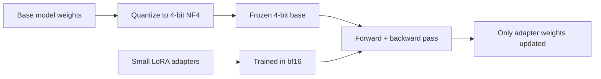

LoRA shrinks the *trainable* parameters dramatically, but the frozen base model still has to sit in GPU memory at full precision — a 70B model in 16-bit still needs roughly 140GB just to load. QLoRA closes that gap by quantizing the frozen base model to 4-bit, while keeping the LoRA adapters themselves in higher precision.



The frozen base model stays quantized throughout training — only the small LoRA adapters, kept at higher precision, actually receive gradient updates, which is what makes fitting a 70B model's fine-tuning onto a single GPU possible.

## The Three Techniques QLoRA Combines

- **4-bit NormalFloat (NF4) quantization** — a quantization format tuned for the actual distribution of pretrained weights, which preserves more information than naive 4-bit rounding
- **Double quantization** — quantizing the quantization constants themselves, saving further memory with negligible quality loss
- **Paged optimizers** — using CPU memory as overflow for optimizer state during rare memory spikes, avoiding out-of-memory crashes without needing to provision for worst-case memory usage

## Setting It Up

```python
from transformers import AutoModelForCausalLM, BitsAndBytesConfig
from peft import LoraConfig, get_peft_model, prepare_model_for_kbit_training
import torch

bnb_config = BitsAndBytesConfig(
    load_in_4bit=True,
    bnb_4bit_quant_type="nf4",
    bnb_4bit_compute_dtype=torch.bfloat16,
    bnb_4bit_use_double_quant=True,
)

model = AutoModelForCausalLM.from_pretrained(
    "meta-llama/Llama-3-70b", quantization_config=bnb_config, device_map="auto"
)
model = prepare_model_for_kbit_training(model)

lora_config = LoraConfig(r=16, lora_alpha=32, target_modules=["q_proj", "v_proj"], task_type="CAUSAL_LM")
model = get_peft_model(model, lora_config)
```

`prepare_model_for_kbit_training` does the necessary setup to make gradient computation stable through the quantized layers — layer norm casting, gradient checkpointing enablement, and input embedding gradient handling — skipping it is a common source of training instability.

## Memory Budget in Practice

A 7B model, full fine-tuning in bf16, needs roughly 60-80GB of GPU memory accounting for optimizer state. The same model with QLoRA fits comfortably in 8-12GB — the difference between needing a multi-GPU cluster and a single consumer GPU with 12-16GB of VRAM.

## The Quality Tradeoff

QLoRA's quantization does introduce a small quality gap relative to full-precision LoRA — generally minor, and well within the noise for most downstream tasks, but worth explicitly checking against your evaluation set rather than assuming it's negligible for your specific use case. If your task is unusually sensitive to precision (numerical reasoning, exact-format generation), validate this before committing to QLoRA over a full-precision LoRA run on rented cloud GPU hours.

## Merging Back for Deployment

At inference time you can either load the quantized base model plus adapter (memory-efficient, slightly slower per token) or merge the adapter into a dequantized full-precision copy of the base model for deployment (faster inference, back to full memory footprint) — covered in detail in the LoRA-adapter serving post later this month.

---

*Part of the [Fine-Tuning series]({{ site.baseurl }}/tags/fine-tuning-series/) — next: [full fine-tuning vs PEFT]({{ site.baseurl }}/posts/full-fine-tuning-vs-peft/) — when the memory savings here aren't actually the right tradeoff to make.*
