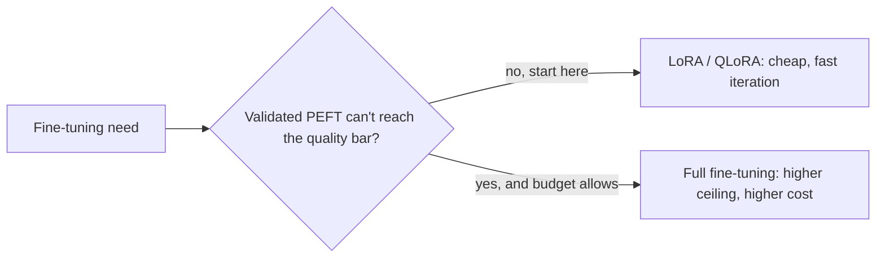

LoRA and QLoRA are both instances of a broader category, PEFT — training a small subset of parameters instead of the whole model. It's worth being explicit about what you give up relative to full fine-tuning, because it isn't nothing.

The practical default below is to start on the left branch for nearly every project, and move right only once real evaluation data — not intuition — shows PEFT genuinely falling short.

## What Full Fine-Tuning Still Does Better

- **Larger behavioral shifts** — teaching a model a genuinely new skill, or substantially changing its reasoning patterns, generally responds better to updating all weights than to a low-rank approximation of the update
- **Domain shift at the vocabulary/representation level** — adapting a model to a domain with substantially different terminology or structure (e.g., a model that needs to reason natively in a specialized notation) benefits from updating embedding and early layers that PEFT methods often leave untouched
- **Maximum achievable quality ceiling** — for a large enough dataset and compute budget, full fine-tuning generally reaches a slightly higher quality ceiling than PEFT on the same task

## What PEFT Wins On, Decisively

- **Cost** — an order of magnitude less GPU memory and compute for equivalent iteration speed
- **Iteration speed** — cheaper training means more experiments per unit of budget, which usually beats a single expensive full fine-tuning run for finding what actually works
- **Storage and deployment flexibility** — dozens of LoRA adapters for different tasks can share one base model in memory; dozens of fully fine-tuned models cannot
- **Reduced catastrophic forgetting** — because most of the base model's weights stay frozen, PEFT methods tend to better preserve general capabilities outside the fine-tuning task's distribution (more on this in the catastrophic forgetting post later this month)

## Other PEFT Methods Beyond LoRA

- **Prefix tuning** — prepends a small number of trainable "virtual tokens" to the input at every layer, leaving all model weights frozen
- **Adapter layers** — inserts small trainable modules between existing frozen layers, an older approach that LoRA has largely superseded due to LoRA's zero added inference latency (adapters, once merged, don't add extra computation at inference; unmerged adapter layers do)
- **IA3** — scales activations with learned vectors rather than adding new weight matrices, even more parameter-efficient than LoRA at a small further capacity cost

## A Practical Default

Start with LoRA or QLoRA for essentially every fine-tuning project. Move to full fine-tuning only if you've validated — with a real evaluation set, not intuition — that PEFT genuinely can't reach the quality bar your task needs, and you have the budget to justify the jump. In practice, the overwhelming majority of production fine-tuning use cases (tone adaptation, format consistency, narrow-domain tool use) are well within what PEFT methods can deliver.

---

*Part of the [Fine-Tuning series]({{ site.baseurl }}/tags/fine-tuning-series/) — next: none of this matters without data, starting with [building an instruction-tuning dataset from scratch]({{ site.baseurl }}/posts/instruction-tuning-dataset-from-scratch/).*
