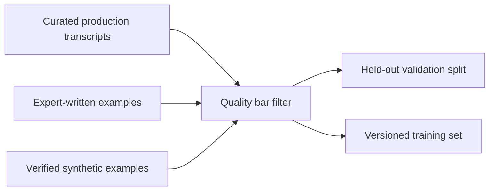

Every fine-tuning technique this month is downstream of one bottleneck: dataset quality. A pristine LoRA setup trained on 200 inconsistent, low-quality examples will underperform a naive full fine-tune trained on 2,000 excellent ones. This is where the real effort in a fine-tuning project should go.



Three sources feed the same quality gate before anything is split for validation — the rest of this post walks through each source and why coverage of the input distribution matters more than raw example count.

## The Format

Most instruction-tuning data follows a simple structure — the exact schema varies by provider, but the shape is consistent:

```json
{
  "messages": [
    {"role": "system", "content": "You are a support agent for Acme Cloud."},
    {"role": "user", "content": "My deployment is stuck in pending state."},
    {"role": "assistant", "content": "Pending deployments are usually a resource quota issue. Check Settings > Quotas — if your CPU or memory limit is maxed out, deployments queue instead of failing outright. Raise the quota or scale down another service to free capacity."}
  ]
}
```

## Where Good Training Examples Actually Come From

- **Real production transcripts, curated** — your best real interactions, hand-selected for quality, are the highest-signal source available. Anonymize and review for correctness before use.
- **Expert-written examples for gaps** — where real data doesn't cover a scenario you need the model to handle well, have a subject-matter expert write the example directly, not an AI-generated approximation of one
- **Synthetic generation, verified** — tomorrow's post covers generating synthetic examples at scale, but every synthetic example needs a verification step before it enters the training set

## Quality Bar Checklist

```python
def passes_quality_bar(example: dict) -> bool:
    response = example["messages"][-1]["content"]
    return (
        len(response) > 20                          # not truncated or empty
        and not contains_refusal_boilerplate(response)  # unless refusal is the intended behavior
        and not contains_placeholder_text(response)  # no "[insert X here]" leftovers
        and matches_target_tone(response)             # consistent with the style you're training toward
    )
```

## Coverage Over Volume, Up to a Point

A common mistake is optimizing purely for example count. What matters more is *coverage* of the input distribution the model will actually see in production — edge cases, ambiguous phrasing, adjacent-but-out-of-scope requests that should be handled a specific way. A few hundred examples that cover the real distribution well outperform several thousand near-duplicates of the easy cases.

## Splitting for Evaluation

Hold out 10-15% of your curated examples as a validation set *before* any augmentation or synthetic expansion touches them — synthetic examples generated from a model that's seen your validation set (directly or indirectly) will leak signal into your evaluation and make your fine-tuned model look better than it actually is.

## Versioning the Dataset Like Code

Treat the training dataset as a versioned artifact — track exactly which dataset version produced which model checkpoint. When a fine-tuned model's behavior needs debugging months later, "what data was this trained on" is the first question, and it needs a precise answer, not "roughly what was in the training folder around then."

---

*Part of the [Fine-Tuning series]({{ site.baseurl }}/tags/fine-tuning-series/) — next: [synthetic data generation]({{ site.baseurl }}/posts/synthetic-data-generation-fine-tuning/) to fill the coverage gaps real data can't.*
