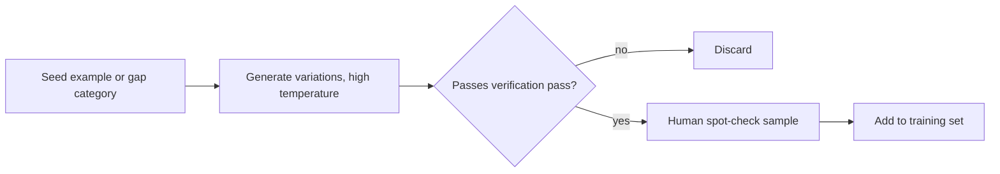

Real data is the gold standard, but it's rarely enough on its own — rare edge cases and adversarial inputs are, by definition, underrepresented in whatever you've collected so far. Synthetic generation fills those gaps, as long as it's done with the verification discipline yesterday's post insisted on.



Generation is the easy part — the verification and spot-checking steps are what keep synthetic data from quietly inheriting the generating model's hallucinations and generic phrasing.

## The Basic Pattern: Seed and Expand

```python
def generate_variations(seed_example: dict, n: int = 5) -> list[dict]:
    resp = llm.chat([{
        "role": "user",
        "content": f"Given this example:\n{json.dumps(seed_example)}\n\n"
                    f"Generate {n} variations with different phrasing, different specific "
                    f"details, but the same underlying scenario and correct response pattern. "
                    f"Return as a JSON list."
    }], temperature=0.9)
    return json.loads(resp.content)
```

Higher temperature here is deliberate — you want lexical and structural diversity across variations, not near-duplicates of the seed with a word swapped.

## Targeted Generation for Known Gaps

More valuable than expanding existing examples is generating for scenarios you know are underrepresented:

```python
gap_categories = [
    "ambiguous requests that need a clarifying question",
    "requests that should be politely declined as out of scope",
    "multi-part requests where only part is answerable",
]

def generate_for_gap(category: str, n: int = 10) -> list[dict]:
    resp = llm.chat([{
        "role": "user",
        "content": f"Generate {n} realistic user support messages that are examples of: {category}. "
                    f"For each, write the ideal assistant response following our style guide: {style_guide}"
    }], temperature=0.8)
    return json.loads(resp.content)
```

## Using a Stronger Model to Generate Training Data for a Weaker One

The most common production use of synthetic data is distillation-flavored: use a large, capable model to generate high-quality responses, then fine-tune a smaller, cheaper model on that output. This is legitimate and effective — check your model provider's usage terms first, since some restrict using outputs to train competing models.

## Verification Is Not Optional

Synthetic data inherits the generating model's failure modes — hallucinated facts, subtly wrong reasoning, or overly generic phrasing that doesn't match your real distribution. Every synthetic batch needs a verification pass before entering the training set:

```python
def verify_synthetic_example(example: dict, rubric: str) -> bool:
    resp = llm.chat([{
        "role": "user",
        "content": f"Does this example meet the rubric?\nRubric: {rubric}\nExample: {json.dumps(example)}\n"
                    f"Answer yes or no, and explain briefly if no."
    }], temperature=0)
    return resp.content.strip().lower().startswith("yes")
```

Sample a subset for human spot-checking regardless of automated verification passing — an LLM judge verifying LLM-generated data can share blind spots with the generator, especially for subtle factual or reasoning errors.

## The Ratio That Tends to Work

A common effective mix is real data as the anchor (even a few hundred high-quality examples), with synthetic data used specifically to widen coverage rather than to replace real data as the majority signal. Watch for a synthetic-heavy dataset drifting the model's tone toward generic AI-generated phrasing rather than your actual desired style — this is the same "AI writing" pattern problem you'd catch in any generated prose, just showing up in your training data instead of a blog post.

---

*Part of the [Fine-Tuning series]({{ site.baseurl }}/tags/fine-tuning-series/) — next: [cleaning and deduplicating]({{ site.baseurl }}/posts/data-cleaning-deduplication-training-sets/) the combined real + synthetic dataset before training.*
