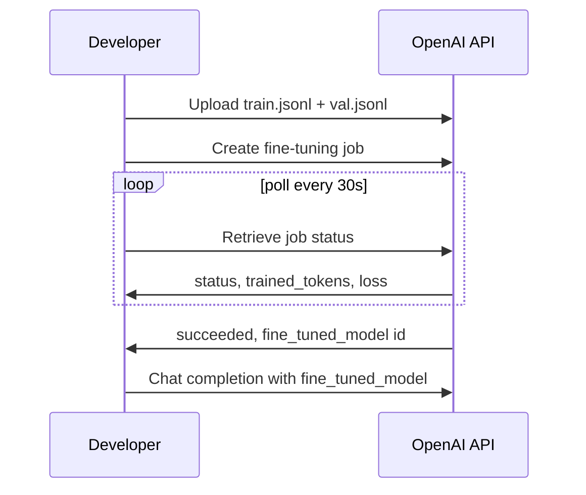

Managed fine-tuning APIs trade control for convenience — no GPU provisioning, no training loop to write, just a dataset upload and a job to monitor. OpenAI's fine-tuning API is the most established example of this pattern.



The whole workflow is upload, create, poll, use — no training loop or GPU provisioning on your side, which is the entire value proposition of a managed fine-tuning API over self-hosting.

## Formatting the Dataset

OpenAI expects JSONL, one training example per line, in the same chat message format used at inference time:

```python
import json

def to_openai_jsonl(examples: list[dict], path: str):
    with open(path, "w") as f:
        for ex in examples:
            f.write(json.dumps({"messages": ex["messages"]}) + "\n")

to_openai_jsonl(cleaned_examples, "train.jsonl")
```

## Uploading and Starting a Job

```python
from openai import OpenAI
client = OpenAI()

training_file = client.files.create(file=open("train.jsonl", "rb"), purpose="fine-tune")
validation_file = client.files.create(file=open("val.jsonl", "rb"), purpose="fine-tune")

job = client.fine_tuning.jobs.create(
    training_file=training_file.id,
    validation_file=validation_file.id,
    model="gpt-4.1-mini-2025-04-14",
    hyperparameters={"n_epochs": 3},
)
```

## Monitoring Training

```python
import time

while True:
    status = client.fine_tuning.jobs.retrieve(job.id)
    print(status.status, status.trained_tokens)
    if status.status in ("succeeded", "failed", "cancelled"):
        break
    time.sleep(30)

events = client.fine_tuning.jobs.list_events(job.id, limit=20)
for e in events.data:
    print(e.message)  # includes per-checkpoint training/validation loss
```

Watch the validation loss curve specifically, not just training loss — a training loss that keeps dropping while validation loss rises is the clearest signal of overfitting, and it's the primary thing `n_epochs` controls: too few and the model underfits, too many and it starts memorizing the training set.

## Using the Fine-Tuned Model

```python
response = client.chat.completions.create(
    model=status.fine_tuned_model,  # e.g. "ft:gpt-4.1-mini-2025-04-14:acme::abc123"
    messages=[{"role": "user", "content": "My deployment is stuck in pending state."}],
)
```

It's called through the API exactly like the base model — no separate serving infrastructure to manage, which is the core value proposition of a managed fine-tuning API over self-hosting.

## What You Don't Control

You don't get to choose the fine-tuning method (LoRA vs full fine-tuning) — that's an implementation detail the provider manages. You don't get the model weights to inspect or export. And pricing is typically per-token for training plus a premium over base-model rates for inference on the fine-tuned model, which needs to be weighed against the alternative of self-hosting an open-weight model with QLoRA, covered in two posts.

## When Managed Fine-Tuning Is the Right Call

If your fine-tuning need is well-served by their supported base models and you don't need weight export or self-hosting, the managed path gets you to a working fine-tuned model with the least engineering overhead — the fastest way to validate whether fine-tuning is worth the investment before committing to a self-hosted pipeline.

---

*Part of the [Fine-Tuning series]({{ site.baseurl }}/tags/fine-tuning-series/) — next: the same managed pattern with [Anthropic's fine-tuning API]({{ site.baseurl }}/posts/fine-tuning-claude-anthropic-api/).*
