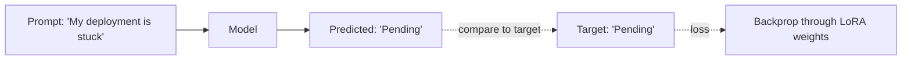

Every fine-tuning example so far has been SFT without naming it explicitly: training on (input, desired output) pairs with a standard next-token-prediction loss. This post opens up what's actually happening during that training loop.

## The Training Objective

SFT trains the model to predict each token of the target response, given everything before it — the same next-token-prediction objective from pretraining, just applied to your curated instruction data instead of general web text.



## Loss Is Only Computed on the Response

A critical detail: loss is masked on the prompt tokens and only computed on the assistant's response tokens. Training on prompt-reconstruction loss would waste capacity teaching the model to predict user input, which it isn't meant to generate:

```python
def build_labels(input_ids: list[int], prompt_length: int) -> list[int]:
    labels = input_ids.copy()
    labels[:prompt_length] = [-100] * prompt_length  # -100 = ignored by the loss function
    return labels
```

`SFTTrainer` from yesterday's post handles this masking automatically based on the chat template, but it's worth understanding explicitly — a common from-scratch implementation bug is forgetting to mask the prompt, which silently degrades training quality without an obvious error.

## Reading a Training Curve Correctly

```python
def diagnose_training(train_loss_history: list[float], val_loss_history: list[float]) -> str:
    if val_loss_history[-1] > val_loss_history[len(val_loss_history) // 2]:
        return "overfitting — validation loss rising, stop earlier or reduce epochs"
    if train_loss_history[-1] > 2.0:
        return "underfitting — loss still high, consider more epochs or higher rank"
    return "looks healthy"
```

The gap between training and validation loss, not either curve in isolation, is the signal that matters — training loss alone will nearly always keep decreasing with more epochs.

## Learning Rate: The Highest-Leverage Hyperparameter

For LoRA fine-tuning, learning rates in the 1e-4 to 3e-4 range are a common effective starting point — an order of magnitude higher than typical full fine-tuning learning rates, because only a small set of parameters is updating and can tolerate larger steps. Too high and training destabilizes (loss spikes or diverges); too low and the model barely adapts within a reasonable number of epochs.

## Chat Templates Matter More Than They Look

The exact special tokens and formatting wrapping each turn (`<|user|>`, `<|assistant|>`, etc.) must match what the base model expects — training with a mismatched template teaches the model a formatting convention it won't see at inference time, which shows up as bizarre completions in production even though training metrics looked fine:

```python
tokenizer.apply_chat_template(messages, tokenize=False)
# Always use the tokenizer's own template — don't hand-construct prompt strings
```

## Epochs: Less Is Usually More

For SFT specifically, 2-4 epochs over a well-curated dataset is a common effective range — far fewer than the dozens of epochs typical in classical ML training, because these models start from a strong pretrained state and only need modest adaptation, not learning from scratch.

---

*Part of the [Fine-Tuning series]({{ site.baseurl }}/tags/fine-tuning-series/) — next: [RLHF explained]({{ site.baseurl }}/posts/rlhf-explained/), the technique that goes beyond matching a fixed target response.*
