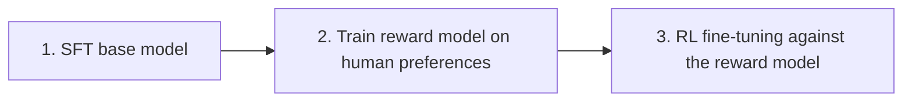

SFT teaches a model to reproduce specific target responses. RLHF teaches it something SFT can't express directly: a general sense of what makes one response *better* than another, learned from human preference judgments rather than fixed targets.

## The Three-Stage Pipeline



**Stage 1** is exactly the SFT covered over the last two posts — get the model to a reasonable baseline first. **Stage 2** trains a separate reward model to score responses the way humans would (covered in depth two posts from now). **Stage 3** uses that reward model as a training signal to further optimize the SFT model via reinforcement learning, typically PPO (Proximal Policy Optimization).

## Why RL Instead of More SFT?

SFT can only teach "produce this exact response." It has no way to express "this response is 70% as good as the ideal one, but still much better than a bad one" — a spectrum, not a fixed target. RL optimizes the model to maximize expected reward across the full space of responses it might generate, which captures that gradient of quality that a single fixed target per example can't.

## The PPO Loop, Conceptually

```python
def rlhf_step(prompt: str, policy_model, reward_model, reference_model):
    response = policy_model.generate(prompt)
    reward = reward_model.score(prompt, response)

    # KL penalty: don't let the policy drift too far from the reference (SFT) model
    kl_penalty = compute_kl_divergence(policy_model, reference_model, prompt, response)
    adjusted_reward = reward - kl_coefficient * kl_penalty

    policy_model.update_via_ppo(prompt, response, adjusted_reward)
```

The `reference_model` — a frozen copy of the SFT model — exists specifically to prevent **reward hacking**: without the KL penalty anchoring the policy to a reasonable starting distribution, a model can find degenerate outputs that score high on the reward model while being useless or bizarre to an actual human.

## Why This Is Genuinely Hard to Get Right

RLHF training is notoriously unstable and expensive relative to SFT — it requires four models loaded simultaneously (policy, reward, reference, and often a value model), careful hyperparameter tuning to avoid reward hacking or training collapse, and a reward model that's only as good as the human preference data it was trained on. This difficulty is exactly what motivated DPO, covered tomorrow, which achieves a similar effect with a dramatically simpler training procedure.

## Where RLHF Is Still Worth It

Despite the complexity, full RLHF remains relevant when you need fine-grained control over the reward signal itself — combining multiple objectives (helpfulness, safety, brevity) with different weights, or iteratively refining the reward model based on where the policy is currently failing. For most practical fine-tuning projects at the scale of a single team or product, DPO gets most of the benefit with far less infrastructure.

---

*Part of the [Fine-Tuning series]({{ site.baseurl }}/tags/fine-tuning-series/) — next: [DPO]({{ site.baseurl }}/posts/dpo-rlhf-without-the-rl/), the simplified alternative most teams should reach for first.*
