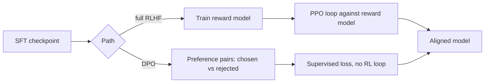

DPO's core insight: you can derive a loss function that has the same effect as full RLHF — optimizing toward human preferences — using ordinary supervised training on preference pairs, with no separate reward model and no reinforcement learning loop at all.



Both paths start from the same SFT checkpoint and end at the same kind of aligned model — DPO just collapses the reward-model-plus-PPO machinery into one ordinary supervised training step on preference pairs.

## The Data Format: Preference Pairs, Not Single Targets

```json
{
  "prompt": "My deployment is stuck in pending state.",
  "chosen": "Pending deployments are usually a quota issue — check Settings > Quotas.",
  "rejected": "I'm not sure, have you tried restarting it?"
}
```

Instead of SFT's single "correct" target, each example is a pair: a response humans preferred (`chosen`) and one they didn't (`rejected`) for the same prompt. This is a fundamentally cheaper form of human annotation to collect — ranking two responses is faster and more reliable for annotators than writing an ideal response from scratch.

## Training with TRL's DPOTrainer

```python
from trl import DPOTrainer, DPOConfig

dpo_config = DPOConfig(
    output_dir="./dpo-output",
    per_device_train_batch_size=2,
    learning_rate=5e-6,
    num_train_epochs=1,
    beta=0.1,  # controls how far the policy can drift from the reference model
)

trainer = DPOTrainer(
    model=sft_model,        # starts from your SFT checkpoint, not the raw base model
    ref_model=None,         # None reuses a frozen copy of the initial model as reference
    args=dpo_config,
    train_dataset=preference_dataset,
    tokenizer=tokenizer,
)
trainer.train()
```

Starting from an SFT checkpoint, not the raw pretrained model, matters — DPO is a *refinement* step on top of an already-instruction-tuned model, not a replacement for the SFT stage.

## What `beta` Actually Controls

`beta` plays the same role the KL penalty coefficient played in yesterday's PPO loop — it controls how strongly the model is pulled back toward its reference behavior versus how freely it can move toward the preferred responses. Lower beta allows more aggressive preference optimization at higher risk of drifting away from general capability; higher beta is more conservative.

## Where Preference Pairs Come From

- **Human annotation** — pairs of model outputs for the same prompt, ranked by human reviewers; the highest quality, most expensive source
- **Model-generated with LLM-as-judge ranking** — generate two responses at different temperatures or from different model versions, have a strong judge model rank them, filter for high-confidence rankings
- **Implicit signal from production** — a user regenerating a response, editing an AI-generated draft, or explicitly rating a response can all be mined into preference pairs, with appropriate care around what that signal actually reflects

## DPO vs Full RLHF: The Practical Verdict

DPO gets the large majority of teams the preference-alignment benefit of RLHF at a fraction of the infrastructure complexity — one training loop, no separate reward model service, standard supervised training tooling. Reach for full RLHF only when DPO's simpler formulation genuinely can't express what you need, which in practice is uncommon outside of frontier-lab-scale alignment work.

---

*Part of the [Fine-Tuning series]({{ site.baseurl }}/tags/fine-tuning-series/) — next: [reward modeling]({{ site.baseurl }}/posts/reward-modeling-teaching-good/) — still worth understanding even if DPO is your default, since it's what preference data is fundamentally teaching either way.*
