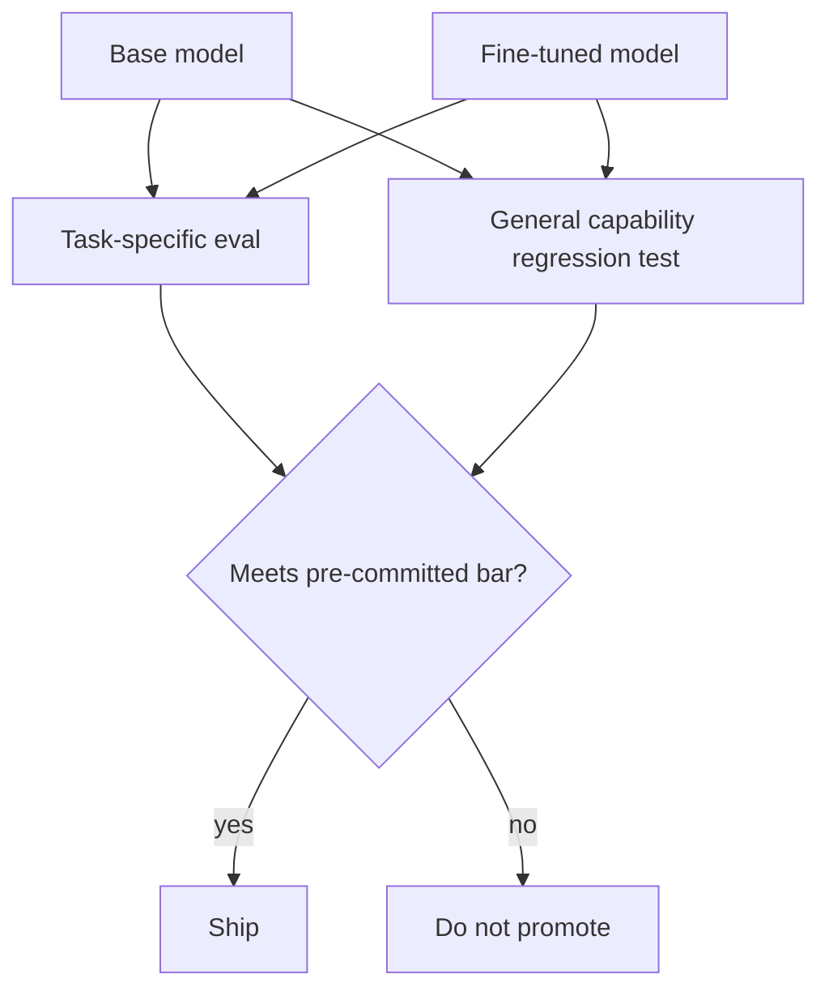

A fine-tuning job finishing successfully tells you the training loop ran without crashing — nothing about whether the resulting model is actually better than what you started with. This evaluation step is what separates a fine-tuning project that ships from one that quietly regresses quality.



Both models run through the same two checks — did the target task improve, and did general capability quietly get worse — scored against a bar set before training started, not after seeing how the numbers look.

## Two Questions, Not One

Every fine-tuned model needs to be checked against two, often competing, criteria:

1. **Did it get better at the target task?** — the thing you fine-tuned it to do
2. **Did it get worse at everything else?** — general capabilities the base model had, that fine-tuning can erode

## Task-Specific Evaluation

```python
def evaluate_on_task(model, test_set: list[dict]) -> dict:
    results = {"correct": 0, "total": len(test_set)}
    for example in test_set:
        response = model.generate(example["prompt"])
        results["correct"] += judge_quality(response, example["expected"], rubric=task_rubric)
    results["accuracy"] = results["correct"] / results["total"]
    return results

base_results = evaluate_on_task(base_model, held_out_test_set)
ft_results = evaluate_on_task(fine_tuned_model, held_out_test_set)
print(f"Base: {base_results['accuracy']:.2%}  Fine-tuned: {ft_results['accuracy']:.2%}")
```

Use the held-out validation set from the dataset-construction posts — never the training set itself, which will always make the fine-tuned model look better than it actually is on unseen input.

## General Capability Regression Testing

Run a broad, generic benchmark set — reasoning, instruction-following, general knowledge questions unrelated to the fine-tuning task — through both models and compare:

```python
def regression_test(base_model, ft_model, general_benchmark: list[dict]) -> dict:
    base_scores = [score_response(base_model.generate(ex["prompt"]), ex) for ex in general_benchmark]
    ft_scores = [score_response(ft_model.generate(ex["prompt"]), ex) for ex in general_benchmark]
    degradation = (sum(base_scores) - sum(ft_scores)) / sum(base_scores)
    return {"degradation_pct": degradation, "flag": degradation > 0.05}
```

A fine-tuned model that gains 15 points on the target task while losing 10 points of general capability is a bad trade for most production use cases, where the model still needs to handle the long tail of requests outside its fine-tuning focus.

## Side-by-Side Human Comparison

For subjective quality dimensions — tone, helpfulness, appropriateness — automated scoring only gets you partway. Run a blind A/B comparison where reviewers see base and fine-tuned outputs for the same prompts, unlabeled, and pick a preference:

```python
def blind_comparison_sample(prompts: list[str], base_model, ft_model) -> list[dict]:
    pairs = []
    for prompt in prompts:
        a, b = base_model.generate(prompt), ft_model.generate(prompt)
        shuffled = random.sample([("A", a), ("B", b)], 2)
        pairs.append({"prompt": prompt, "option_a": shuffled[0][1], "option_b": shuffled[1][1],
                       "a_is": shuffled[0][0]})
    return pairs
```

## The Decision Gate

Set a quantitative bar before training, not after seeing results — task improvement above X%, general capability degradation below Y%. Evaluating without a pre-committed bar invites motivated reasoning toward "this looks good enough to ship" regardless of what the numbers actually show.

---

*Part of the [Fine-Tuning series]({{ site.baseurl }}/tags/fine-tuning-series/) — next: [catastrophic forgetting]({{ site.baseurl }}/posts/catastrophic-forgetting-avoid/), the specific mechanism behind the general-capability degradation this post's regression test is designed to catch.*
