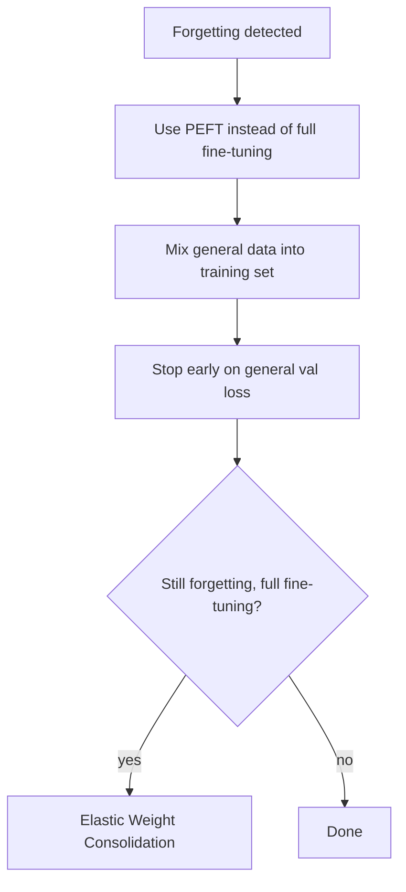

Yesterday's regression test measured *whether* fine-tuning degraded general capability. This post covers *why* it happens and the concrete techniques for preventing it — the single most common way a fine-tuning project quietly makes a model worse overall while appearing to succeed on its narrow target metric.



The four mitigations chain in priority order — try PEFT, then data mixing, then early stopping, and reach for EWC only in the rare full-fine-tuning case where the first three aren't enough.

## Why It Happens

Neural network training updates weights to minimize loss on whatever data is currently being trained on, with no inherent mechanism protecting knowledge encoded from earlier training. A narrow, repetitive fine-tuning dataset can push weights toward overfitting on that narrow distribution, overwriting more general representations the base model had learned during pretraining — especially with too many epochs or too high a learning rate on too small a dataset.

## Mitigation 1: PEFT Methods Inherently Help

This is one of LoRA's underappreciated benefits: because most of the base model's weights stay completely frozen, PEFT methods structurally limit how much general capability can be overwritten, compared to full fine-tuning where every weight is fair game for the optimizer to change.

## Mitigation 2: Mix General Data Into the Fine-Tuning Set

```python
def build_training_mix(task_examples: list[dict], general_examples: list[dict], ratio: float = 0.15) -> list[dict]:
    n_general = int(len(task_examples) * ratio / (1 - ratio))
    return task_examples + random.sample(general_examples, min(n_general, len(general_examples)))
```

Interleaving a modest fraction of general-purpose instruction data (unrelated to the target task) alongside task-specific examples gives the optimizer a reason to keep general capabilities intact, not just optimize purely for the narrow task.

## Mitigation 3: Fewer Epochs, Earlier Stopping

The training-curve diagnosis from the SFT post applies directly here — the point where validation loss on a *general* held-out set starts rising, not just task-specific loss, is often the real signal to stop, even if task-specific loss would keep improving with more epochs.

```python
def should_stop_early(task_val_loss: list[float], general_val_loss: list[float], patience: int = 2) -> bool:
    if len(general_val_loss) < patience + 1:
        return False
    return general_val_loss[-1] > min(general_val_loss[-patience-1:-1])
```

## Mitigation 4: Lower Learning Rate, Especially for Full Fine-Tuning

Aggressive learning rates accelerate task-specific adaptation at the direct cost of preserving general knowledge. If forgetting shows up in evaluation, dropping the learning rate and extending training length (more epochs at a gentler pace) often recovers general capability without sacrificing much task performance.

## Mitigation 5: Elastic Weight Consolidation (For Full Fine-Tuning)

For cases where full fine-tuning is genuinely necessary, techniques like EWC add a penalty term that specifically discourages large changes to weights that were important for the base model's general capabilities, estimated via the Fisher information matrix — more complex to implement than the mitigations above, and rarely necessary once PEFT and data-mixing are already in place.

## The Practical Priority Order

Try PEFT first, data mixing second, and early stopping against a general benchmark third — in that order, before reaching for anything more exotic. Together, these three catch the large majority of catastrophic forgetting cases without adding meaningful complexity to a standard fine-tuning pipeline.

---

*Part of the [Fine-Tuning series]({{ site.baseurl }}/tags/fine-tuning-series/) — next: applying all of this to [domain adaptation]({{ site.baseurl }}/posts/domain-adaptation-legal-medical-finance/) in regulated, high-stakes fields.*
