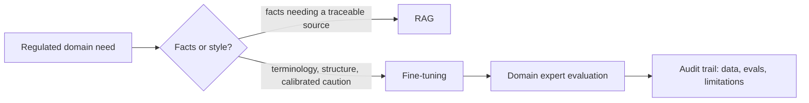

Regulated domains are where fine-tuning's tradeoffs get sharpest: the upside of consistent, domain-correct output is real, and the cost of a subtle error is much higher than in a general-purpose chatbot. This post covers what's different about fine-tuning for these fields specifically.



The conservative default this post lands on is right here: keep facts in retrieval where they stay traceable, and reserve fine-tuning specifically for the structural and tonal conventions these fields demand.

## Why General-Purpose Models Fall Short Here

- **Terminology precision** — "material" means something specific and different in law versus general English; a model needs to consistently use domain terms correctly, not just recognize them
- **Structural conventions** — legal documents, clinical notes, and financial disclosures each follow rigid structural conventions that a general instruction-tuned model wasn't specifically trained to reproduce
- **Calibrated caution** — these domains need a model that expresses appropriate uncertainty and defers to a human on ambiguous cases far more readily than general-purpose helpfulness training encourages

## Fine-Tuning for Calibrated Refusal

A domain-adapted model needs training examples that teach it *when to decline to answer directly*, not just how to answer:

```json
{
  "messages": [
    {"role": "user", "content": "Can I terminate this contract without notice given clause 7.2?"},
    {"role": "assistant", "content": "Clause 7.2 as written appears to require 30 days' written notice for termination. Whether this specific situation meets an exception depends on facts I don't have full visibility into — I'd recommend having a licensed attorney review the specific circumstances before acting on this."}
  ]
}
```

Training explicitly on this pattern — informative, but clearly bounded, with an explicit handoff — is what separates a genuinely useful domain assistant from one that confidently oversteps its role.

## Data Sourcing Is the Hard Part

Real domain data in these fields is often subject to strict confidentiality (attorney-client privilege, HIPAA-protected health information, non-public financial data) that makes it unusable for training without careful de-identification — which itself needs domain expertise to do correctly, since naive PII scrubbing can miss domain-specific identifiers (a rare diagnosis combined with a demographic detail can be re-identifying even with names removed).

## Involve Domain Experts in Evaluation, Not Just Data Creation

A generic LLM-as-judge, however well-prompted, is a weak evaluator for domain correctness in law or medicine — it doesn't reliably know what's actually correct. Domain expert review needs to be part of the evaluation loop, not just the data-creation loop, before any fine-tuned model in these fields reaches production use.

## Compliance and Audit Trail Requirements

Regulated industries typically require documented evidence of what a model was trained on, how it was evaluated, and what its known limitations are — treat this as a first-class deliverable of the fine-tuning project, not an afterthought. This connects directly to the model risk management and audit logging practices covered in September's AI security series, which apply with particular force in these fields.

## The Conservative Default

When in doubt in a regulated domain, favor RAG over fine-tuning for factual grounding (facts need to be traceable to a source, which fine-tuned weights can't provide), and reserve fine-tuning specifically for structural and tonal conventions where the domain-appropriate *style* of response is what needs improving — not the underlying facts.

---

*Part of the [Fine-Tuning series]({{ site.baseurl }}/tags/fine-tuning-series/) — next: [fine-tuning for tool use]({{ site.baseurl }}/posts/fine-tuning-tool-use-function-calling/), a narrower and more mechanical domain-adaptation problem.*
