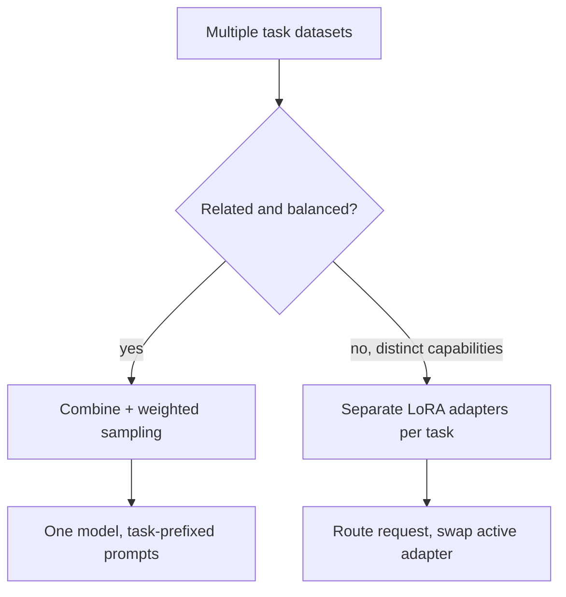

Everything so far has assumed one fine-tuning run targets one task. Production systems usually need a model that's good at several distinct things at once — classification, extraction, and drafting, say — and how you combine those tasks in training meaningfully affects the outcome.



The core choice is combined training versus separate adapters — related, balanced tasks share representations well in one run, while genuinely distinct capabilities do better isolated so a fix to one doesn't force retraining the other.

## The Naive Approach: Just Mix the Data

```python
combined_dataset = classification_examples + extraction_examples + drafting_examples
random.shuffle(combined_dataset)
```

This works reasonably well when tasks are related and roughly balanced in size, but breaks down when one task's dataset dwarfs another's — the larger task dominates training and the smaller one gets undertrained, effectively forgotten within the same training run.

## Weighted Sampling to Balance Tasks

```python
def build_balanced_batches(task_datasets: dict[str, list], target_per_task: int) -> list[dict]:
    balanced = []
    for task, examples in task_datasets.items():
        if len(examples) < target_per_task:
            balanced.extend(examples * (target_per_task // len(examples) + 1))
            balanced = balanced[:len(balanced) - (len(examples) * (target_per_task // len(examples) + 1) - target_per_task)]
        else:
            balanced.extend(random.sample(examples, target_per_task))
    random.shuffle(balanced)
    return balanced
```

Oversampling a small task's examples (with repetition) to match the volume of a larger one gives the optimizer roughly equal exposure to each task per epoch, rather than letting dataset size alone determine how much each task gets learned.

## Task Prefixes: Telling the Model Which Skill to Use

Including an explicit task indicator in the prompt during both training and inference helps the model separate its learned skills cleanly:

```json
{"messages": [
  {"role": "system", "content": "Task: classify_intent"},
  {"role": "user", "content": "..."}
]}
```

Without this, tasks with structurally similar inputs but different desired output formats can bleed into each other — the model applying extraction-style output to what should have been a classification response, for instance.

## Separate LoRA Adapters vs One Combined Adapter

An alternative to combining everything into one training run: train separate LoRA adapters per task, and swap which adapter is active based on the current request's task type. This avoids any cross-task interference entirely, at the cost of needing to route requests to the right adapter — a decision covered in depth in August's post on serving multiple LoRA adapters from one base model.

```python
def route_and_serve(request: dict) -> str:
    task = classify_request_task(request)  # cheap classification step
    adapter = load_adapter(f"adapters/{task}")
    return generate_with_adapter(model, adapter, request)
```

## Choosing Between Combined and Separate Training

Combine tasks into one training run when they're related enough to benefit from shared representations (several types of customer support intents, for instance). Keep tasks in separate adapters when they're genuinely distinct capabilities with different quality bars and different iteration cadences — you don't want a fix to your extraction task's data to require retraining your unrelated classification task's adapter too.

---

*Part of the [Fine-Tuning series]({{ site.baseurl }}/tags/fine-tuning-series/) — next: [quantization explained]({{ site.baseurl }}/posts/quantization-explained-int8-int4-gptq/), a technique that applies whether you fine-tuned or not.*
