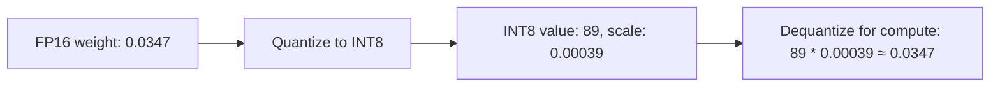

QLoRA used 4-bit quantization to make training fit on smaller GPUs. Quantization is equally, maybe more, relevant at *inference* time — it's the single biggest lever for reducing the memory and compute cost of serving a model you've already trained.

## What Quantization Actually Does

Model weights are normally stored as 16-bit or 32-bit floating point numbers. Quantization maps them to lower-precision representations — 8-bit or 4-bit integers — trading some numerical precision for dramatically less memory and, on supported hardware, faster computation.



## Post-Training Quantization: GPTQ

GPTQ quantizes an already-trained model's weights, layer by layer, minimizing the quantization error's impact on the model's actual output rather than naively rounding each weight independently:

```python
from optimum.gptq import GPTQQuantizer

quantizer = GPTQQuantizer(bits=4, dataset="c4", model_seqlen=2048)
quantized_model = quantizer.quantize_model(model, tokenizer)
quantizer.save(quantized_model, "./model-gptq-4bit")
```

The `dataset` parameter matters — GPTQ uses a calibration dataset to determine which weights are more sensitive to quantization error and protect them more carefully, so calibrating on data representative of your actual use case improves quality over a generic calibration set.

## AWQ: An Alternative Approach

Activation-aware Weight Quantization (AWQ) takes a different tack — instead of minimizing weight quantization error directly, it identifies which weights matter most based on the *activations* they interact with during inference, and preserves precision specifically for those. In practice, AWQ and GPTQ produce comparably strong results; the ecosystem tooling and hardware support available for each is often the deciding factor.

## The Precision-Size-Speed Tradeoff Table

| Precision | Relative size | Quality impact | Typical use |
|---|---|---|---|
| FP16/BF16 | 100% (baseline) | None | Training, quality-critical serving |
| INT8 | ~50% | Minimal | General serving, good default |
| INT4 (GPTQ/AWQ) | ~25% | Small, task-dependent | Memory-constrained serving |
| INT4 (naive rounding) | ~25% | Larger, avoid in production | Not recommended |

## Always Validate Quantized Quality Against the Full-Precision Baseline

Quantization quality loss is generally small but not zero, and it's not uniform across tasks — a model can lose noticeably more quality on precise numerical reasoning than on open-ended text generation at the same bit width. Run the same evaluation harness from the fine-tuned-model-evaluation post against both the full-precision and quantized versions before deploying a quantized model to production.

## Where This Connects Forward

Quantization is one of the core levers August's infrastructure series covers for controlling inference cost and memory footprint at scale — a fine-tuned LoRA adapter on top of a quantized base model (exactly QLoRA's inference-time equivalent) is a common, effective combination for cost-efficient production serving.

---

*Part of the [Fine-Tuning series]({{ site.baseurl }}/tags/fine-tuning-series/) — next: [model distillation]({{ site.baseurl }}/posts/model-distillation-training-small-from-big/), a complementary technique for shrinking model cost.*
