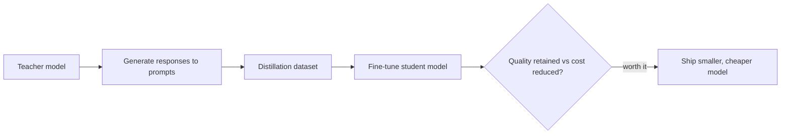

Quantization shrinks an existing model. Distillation trains a genuinely smaller model, from scratch or from a small pretrained base, to approximate a larger "teacher" model's behavior on your specific task — often reaching much of the teacher's quality on that narrow task at a fraction of its inference cost.



Response distillation is just synthetic data generation applied to one specific goal — capturing a teacher's behavior for a student to learn from — so the same verification discipline from earlier this month still applies.

## The Basic Recipe

```python
def generate_distillation_data(teacher_model, prompts: list[str]) -> list[dict]:
    dataset = []
    for prompt in prompts:
        teacher_response = teacher_model.generate(prompt, temperature=0.3)
        dataset.append({"messages": [{"role": "user", "content": prompt},
                                      {"role": "assistant", "content": teacher_response}]})
    return dataset

distillation_data = generate_distillation_data(large_model, representative_prompts)
# Then fine-tune a small model (student) on this data using the SFT pipeline from earlier this month
```

This is, mechanically, synthetic data generation from earlier this month applied specifically to capturing one model's behavior for training another — the same verification discipline from that post still applies.

## Response Distillation vs Logit Distillation

The recipe above — training on the teacher's final text output — is response distillation, and it's what's practical when you only have API access to the teacher model. If you have direct access to the teacher's weights, logit distillation trains the student to match the teacher's full output probability distribution, not just its single sampled response, which typically transfers more nuanced behavior:

```python
def distillation_loss(student_logits, teacher_logits, temperature: float = 2.0):
    student_probs = F.log_softmax(student_logits / temperature, dim=-1)
    teacher_probs = F.softmax(teacher_logits / temperature, dim=-1)
    return F.kl_div(student_probs, teacher_probs, reduction="batchmean") * (temperature ** 2)
```

## What Transfers Well, and What Doesn't

Distillation works best for narrow, well-defined tasks — classification, extraction, a specific style of response — where the student doesn't need the teacher's full general capability, only its behavior on that slice. It transfers poorly for tasks requiring broad world knowledge or complex multi-step reasoning the smaller model's architecture may not have the capacity to represent at all, regardless of training signal quality.

## Measuring the Cost-Quality Curve

```python
def evaluate_distillation_tradeoff(teacher, student, test_set) -> dict:
    teacher_quality = evaluate_on_task(teacher, test_set)["accuracy"]
    student_quality = evaluate_on_task(student, test_set)["accuracy"]
    return {
        "quality_retained_pct": student_quality / teacher_quality,
        "cost_reduction_pct": 1 - (student.cost_per_token / teacher.cost_per_token),
    }
```

A distillation project is worth shipping when quality retained is high relative to cost reduction — commonly, teams find retaining 90%+ of teacher quality at a fraction of the cost, but this varies significantly by task and needs measuring directly, not assumed.

## Distillation vs Fine-Tuning: Not Actually Different Techniques

Distillation is a special case of the fine-tuning pipeline covered all month, distinguished mainly by where the training data comes from (a teacher model rather than human-curated examples) and the explicit goal (matching a specific model's behavior rather than an abstract task specification). Every technique from dataset construction through evaluation applies directly.

---

*Part of the [Fine-Tuning series]({{ site.baseurl }}/tags/fine-tuning-series/) — next: [merging fine-tuned models]({{ site.baseurl }}/posts/merging-fine-tuned-models-soups-ties/), for combining multiple specialized checkpoints into one.*
