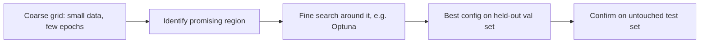

Every fine-tuning code example this month has hardcoded reasonable hyperparameter defaults. This post covers how to actually find good values for your specific dataset and task, rather than trusting a default that was tuned for someone else's use case.



The coarse-then-fine search keeps expensive full-budget training runs reserved for the small number of configurations that survive the cheap first pass, and the final test-set check guards against overfitting to the validation set itself.

## The Hyperparameters That Matter Most, Ranked

1. **Learning rate** — the single highest-leverage knob; too high destabilizes training, too low undertrains within a reasonable epoch budget
2. **LoRA rank and alpha** — controls adaptation capacity, covered in the LoRA post
3. **Number of epochs** — interacts directly with catastrophic forgetting and overfitting risk
4. **Effective batch size** — affects training stability and, to a lesser degree, final quality

Everything else (dropout, warmup steps, weight decay) matters, but tuning these first typically captures most of the achievable improvement.

## A Practical Search Strategy: Coarse Then Fine

```python
def hyperparameter_sweep(configs: list[dict], train_data, val_data) -> list[dict]:
    results = []
    for config in configs:
        model = train_with_config(config, train_data)
        score = evaluate_on_task(model, val_data)["accuracy"]
        results.append({**config, "val_accuracy": score})
    return sorted(results, key=lambda r: -r["val_accuracy"])

coarse_grid = [
    {"learning_rate": lr, "lora_rank": r}
    for lr in [1e-4, 2e-4, 5e-4]
    for r in [8, 16, 32]
]
coarse_results = hyperparameter_sweep(coarse_grid, train_data, val_data)
# Then refine the search around the best coarse region
```

A coarse grid across an order of magnitude in learning rate, combined with a few rank values, usually locates the productive region quickly — a full fine-grained grid search is rarely worth the compute cost for most fine-tuning projects.

## Using a Framework Instead of a Manual Grid

For a larger search space, a proper hyperparameter optimization tool beats brute-force grid search:

```python
import optuna

def objective(trial):
    lr = trial.suggest_float("learning_rate", 1e-5, 1e-3, log=True)
    rank = trial.suggest_categorical("lora_rank", [8, 16, 32, 64])
    model = train_with_config({"learning_rate": lr, "lora_rank": rank}, train_data)
    return evaluate_on_task(model, val_data)["accuracy"]

study = optuna.create_study(direction="maximize")
study.optimize(objective, n_trials=20)
```

Optuna's Bayesian search explores the space more efficiently than a full grid, converging on good regions faster with the same compute budget — worth the setup cost once you're running more than a handful of sweep configurations.

## Guard Against Overfitting to the Validation Set Itself

Running dozens of configurations and picking whichever scores highest on your validation set risks overfitting to that specific validation set's quirks, not genuinely finding the best general configuration. Hold out a separate final test set, untouched during the entire sweep, and confirm the winning configuration's performance holds up there before calling the search complete.

## Cost-Aware Search

Every trial in a sweep costs real training compute. Use a small subset of your training data and fewer epochs for the initial coarse search, then run the full training budget only on the small number of promising configurations that survive that first pass — an early-stopping approach to the search itself.

---

*Part of the [Fine-Tuning series]({{ site.baseurl }}/tags/fine-tuning-series/) — next: [tracking experiments]({{ site.baseurl }}/posts/tracking-fine-tuning-experiments-wandb/) so a sweep like this one is actually reproducible and comparable.*
