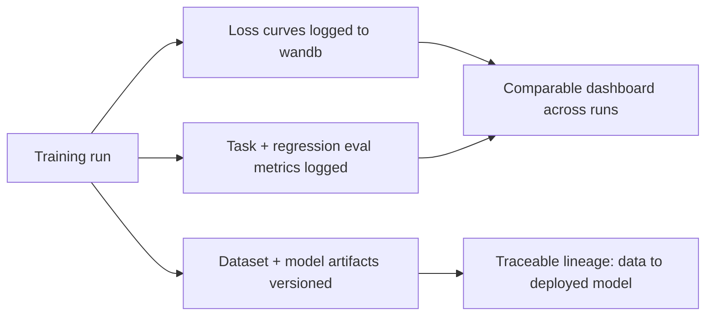

Yesterday's hyperparameter sweep produces dozens of runs with different configs and results. Without systematic tracking, "which config produced the model we shipped" becomes an unanswerable question within a few weeks — exactly the kind of gap experiment tracking exists to close.



Everything a run produces — loss curves, eval scores, and versioned artifacts — lands in the same dashboard, which is what turns "which config did we ship" from a scroll through logs into a queryable answer.

## Instrumenting a Training Run

```python
import wandb

wandb.init(project="support-agent-finetune", config={
    "learning_rate": 2e-4,
    "lora_rank": 16,
    "epochs": 3,
    "dataset_version": "v3-deduped",
})

training_config = SFTConfig(
    output_dir="./ft-output",
    report_to="wandb",  # TRL/Transformers logs loss curves automatically
    learning_rate=wandb.config.learning_rate,
)
```

`report_to="wandb"` is what pipes training and validation loss curves to the dashboard automatically, without manual logging code — every checkpoint's metrics become comparable across runs without extra instrumentation.

## Logging Evaluation Results, Not Just Training Loss

Training loss alone doesn't tell you if the model is actually good at the task — log the task-specific evaluation and general-capability regression scores from the evaluation post as custom metrics on the same run:

```python
eval_results = evaluate_on_task(trained_model, held_out_test_set)
regression_results = regression_test(base_model, trained_model, general_benchmark)

wandb.log({
    "task_accuracy": eval_results["accuracy"],
    "general_capability_degradation": regression_results["degradation_pct"],
})
```

## Comparing Runs Systematically

```python
api = wandb.Api()
runs = api.runs("support-agent-finetune")
comparison = sorted(
    [{"name": r.name, "lr": r.config["learning_rate"], "rank": r.config["lora_rank"],
      "accuracy": r.summary.get("task_accuracy")} for r in runs],
    key=lambda x: -(x["accuracy"] or 0),
)
```

A dashboard sorted this way turns "which hyperparameters worked best" from a scroll through terminal logs into a queryable, sortable view across every run the team has ever kicked off.

## Artifact Versioning: Linking Data, Code, and Model

```python
dataset_artifact = wandb.Artifact("training-data", type="dataset")
dataset_artifact.add_file("train.jsonl")
wandb.log_artifact(dataset_artifact)

model_artifact = wandb.Artifact("fine-tuned-model", type="model")
model_artifact.add_dir("./ft-output/final-adapter")
wandb.log_artifact(model_artifact)
```

This closes the traceability loop from the dataset-versioning point earlier this month — given any deployed model, you can trace back through the artifact lineage to the exact dataset version, code commit, and hyperparameters that produced it, which matters enormously for debugging a production regression months after the training run.

## Team Visibility as the Real Payoff

Beyond individual experiment tracking, a shared dashboard prevents the common organizational failure mode of two team members separately rediscovering the same failed hyperparameter combination weeks apart — the value compounds with team size, not just with the number of experiments any one person runs.

---

*Part of the [Fine-Tuning series]({{ site.baseurl }}/tags/fine-tuning-series/) — next: [when fine-tuning goes wrong]({{ site.baseurl }}/posts/when-fine-tuning-goes-wrong/) — the failure modes good tracking helps you actually catch.*
