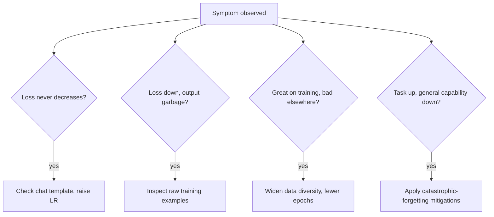

Every technique this month can go wrong in specific, recognizable ways. This is a field guide to the most common fine-tuning failures, how to recognize each one, and the fix — pattern-matched against the mitigations already covered this month.

Each failure mode has a distinct symptom and a targeted fix rather than a generic "retrain and hope" response — the diagram maps the four most common symptoms straight to the diagnostic step that identifies the actual cause.

## Failure: Training Loss Never Decreases

**Symptom:** loss stays flat or barely moves across epochs.
**Likely causes:** learning rate too low, prompt-masking bug feeding the model no real learning signal, or a data formatting mismatch with the base model's expected chat template.
**Fix:** verify the chat template first (the most common actual culprit), then try a 5-10x higher learning rate as a diagnostic.

## Failure: Loss Decreases, Output Is Garbage

**Symptom:** training metrics look healthy, but generated text is incoherent or repetitive.
**Likely causes:** learning rate too high causing instability, or corrupted/misaligned training data (input and target mismatched).
**Fix:** inspect raw training examples directly — this is the "read 30 examples by hand" step from the dataset-cleaning post, and it catches this failure mode more reliably than any automated check.

## Failure: The Model Overfits to a Narrow Pattern

**Symptom:** the model performs perfectly on training-set-like inputs and poorly on anything phrased differently.
**Likely causes:** insufficient data diversity, too many epochs on too small a dataset.
**Fix:** widen phrasing diversity in training data (the synthetic-variation technique from earlier this month), reduce epochs, and check the train/validation loss gap explicitly.

## Failure: General Capability Silently Degrades

**Symptom:** task metric improves, but the model gets noticeably worse at unrelated requests in production.
**Likely causes:** catastrophic forgetting from too aggressive full fine-tuning, or a training mix with no general-purpose data at all.
**Fix:** apply the mitigations from the catastrophic forgetting post — PEFT, data mixing, early stopping against a general benchmark.

## Failure: The Model Learns the Wrong Lesson

**Symptom:** the model picks up on a spurious correlation in the training data rather than the intended skill — e.g., always predicting the majority category because the dataset was imbalanced.
**Likely causes:** category imbalance, or an unintended pattern correlated with the label (all "urgent" examples happen to be longer, so the model learns "long = urgent" instead of the actual semantic signal).
**Fix:** check category balance explicitly (from the multi-task and data-cleaning posts), and test the model on adversarial examples specifically designed to break the spurious correlation.

## Failure: The Fine-Tuned Model Regresses After a Base Model Update

**Symptom:** a LoRA adapter trained against one version of a base model performs worse, or errors outright, after the provider updates the underlying base model.
**Likely causes:** adapter weights are tightly coupled to the specific base model checkpoint they were trained against; a base model update can shift the underlying representation enough to break that coupling.
**Fix:** pin base model versions explicitly where your provider allows it, and re-evaluate (and if needed, retrain) adapters whenever a base model version changes rather than assuming compatibility.

## The Meta-Lesson

Nearly every failure mode above is caught earlier and cheaper by the evaluation and tracking discipline from the last several posts than by debugging after a bad model has already shipped. Treat evaluation as a gate, not a post-hoc check.

---

*Part of the [Fine-Tuning series]({{ site.baseurl }}/tags/fine-tuning-series/) — next: [serving fine-tuned models]({{ site.baseurl }}/posts/serving-fine-tuned-lora-adapters-runtime/) once one has actually passed all these checks.*
