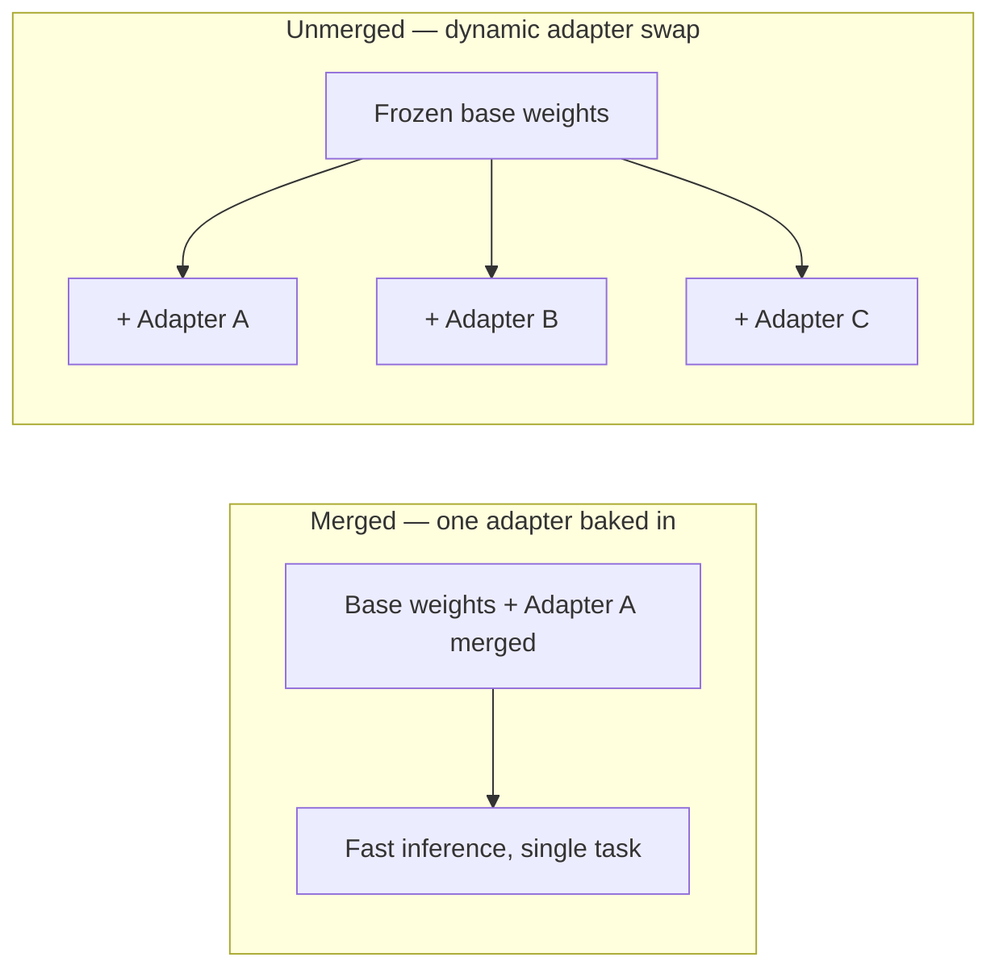

A trained LoRA adapter is only useful once it's serving real traffic. The multi-task post touched on adapter swapping; this covers the actual serving architecture — and the option that makes LoRA distinctly cheaper to operate than fully fine-tuned models at scale.

## Merged vs Unmerged Serving



**Merged**: bake the adapter's weight delta directly into a copy of the base model. Fastest inference (no extra computation per request), but you need a separate full model copy per adapter — losing LoRA's memory advantage at serving time.

```python
merged_model = peft_model.merge_and_unload()
merged_model.save_pretrained("./merged-model")
```

**Unmerged**: keep the base model frozen in memory once, and apply different adapters per request. Slightly more compute per request (the adapter's matrix multiplication happens at inference time), but dramatically more memory-efficient when serving many different task-specific adapters from one deployment.

## Multi-Adapter Serving with vLLM

Production inference servers now support serving multiple LoRA adapters from a single loaded base model, switching per-request:

```python
from vllm import LLM, SamplingParams
from vllm.lora.request import LoRARequest

llm = LLM(model="meta-llama/Llama-3-8b-Instruct", enable_lora=True, max_loras=8)

outputs = llm.generate(
    prompts=["Classify this support ticket: ..."],
    sampling_params=SamplingParams(temperature=0),
    lora_request=LoRARequest("support-classifier", 1, "./adapters/support-classifier"),
)
```

This is the practical foundation for the multi-task adapter-routing pattern from earlier this month — one base model deployment, several task-specific adapters, request-time routing decides which applies. It amortizes the base model's memory footprint across every task, which is the core economic advantage of LoRA-based multi-task serving over deploying separately fine-tuned full models per task.

## Hot-Swapping Adapters Without Downtime

```python
def deploy_new_adapter_version(adapter_name: str, new_path: str):
    validate_adapter(new_path)  # run the evaluation suite before swapping
    llm.add_lora(LoRARequest(adapter_name, get_next_version_id(), new_path))
    # traffic can be gradually shifted to the new version ID before removing the old one
```

Loading a new adapter version alongside the old one, rather than replacing it in place, enables the same canary-rollout pattern from April's production deployment post — applied to model updates instead of code deploys.

## Latency Overhead in Practice

The extra computation from an unmerged adapter's matrix multiplication is small relative to the full forward pass through a large base model — for most production workloads, the latency difference between merged and unmerged serving is a rounding error, and the memory savings of unmerged multi-adapter serving are usually well worth that negligible cost.

## Choosing Based on Deployment Shape

Merge when you're serving exactly one fine-tuned task from a dedicated deployment and want maximum inference speed. Keep adapters unmerged and use multi-adapter serving the moment you're supporting more than a couple of task-specific fine-tunes from shared infrastructure — which is the common case in any organization running more than one fine-tuning project.

---

*Part of the [Fine-Tuning series]({{ site.baseurl }}/tags/fine-tuning-series/) — next: [the economics of fine-tuning]({{ site.baseurl }}/posts/economics-of-fine-tuning-cost-benefit/), tying serving cost back to the original build-vs-buy decision.*
