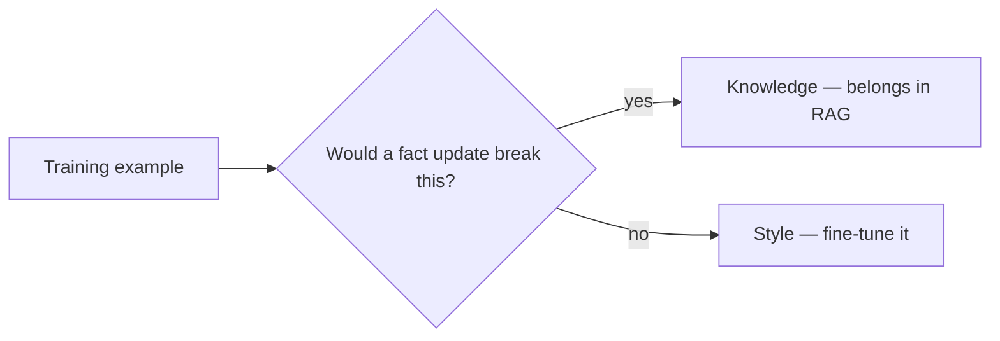

The very first post this month drew a line between facts (belong in RAG) and behavior (fair game for fine-tuning). This post sharpens that further: within "behavior," style and knowledge respond very differently to fine-tuning, and conflating them is a common source of disappointing results.



The heuristic from later in this post reduces to a single routing question: does the example encode a volatile fact, or a reusable response pattern? Everything below walks through why that split matters and how to apply it in practice.

## Style: What Fine-Tuning Is Genuinely Good At

Style — tone, phrasing conventions, format, terminology preference, the shape of a response — is exactly what fine-tuning was covered doing well all month. It's a *pattern* to be learned from examples, not a discrete fact to be memorized, and this is precisely what gradient descent on demonstration data is good at capturing.

```python
# Style fine-tuning: teaching HOW to respond, not new facts
{"messages": [
    {"role": "user", "content": "What's the deploy process?"},
    {"role": "assistant", "content": "Quick version: `git push`, CI runs, auto-deploys to staging. Prod needs a manual approve in the dashboard. That's it."}
]}
```

## Knowledge: What Fine-Tuning Is Bad At, and Why

Fine-tuning a model on facts teaches it to reproduce those facts *when the training pattern is closely matched* — it doesn't reliably generalize to related questions the training data didn't cover, and it doesn't update when the underlying facts change. A model fine-tuned on last quarter's pricing page will confidently state stale prices with no mechanism to know they've changed, unlike RAG where updating the source document fixes it instantly.

```python
# This teaches memorization of one fact pattern, not general "knowing" — a bad use of fine-tuning
{"messages": [
    {"role": "user", "content": "What's the price of the Pro plan?"},
    {"role": "assistant", "content": "The Pro plan is $49/month."}
]}
```

## The Test: Would a Fact Update Break This?

A useful heuristic for classifying a training example: if the underlying fact changed tomorrow, would this example become wrong? If yes, it's knowledge and belongs in a retrieval system, not baked into weights. If the response pattern would still be *correct in structure* even with different specific facts substituted in, it's style, and fine-tuning is the right tool.

```python
def classify_example(example: dict) -> str:
    response = example["messages"][-1]["content"]
    return "knowledge" if contains_volatile_fact(response) else "style"
```

## Combining Both, Correctly

The strongest production systems use both together, cleanly separated: a fine-tuned model for consistent tone, format, and reasoning approach, combined with RAG-retrieved context for anything factual, with the fine-tuning training data specifically avoiding baking in facts that belong in the retrieval layer instead:

```python
{"messages": [
    {"role": "system", "content": "Answer in the style demonstrated: concise, no hedging, direct."},
    {"role": "user", "content": f"Context: {retrieved_docs}\n\nQuestion: {question}"},
    {"role": "assistant", "content": "..."}  # style is what's being trained, facts come from context
]}
```

## Auditing an Existing Fine-Tuning Dataset for This Mix-Up

Before your next fine-tuning run, sample 20-30 training examples and classify each with the heuristic above. A dataset that's mostly knowledge examples is a signal the project should be RAG, not fine-tuning — catching this before training, not after evaluating a disappointing result, saves the full cost of a training cycle.

---

*Part of the [Fine-Tuning series]({{ site.baseurl }}/tags/fine-tuning-series/) — closing tomorrow with [a complete fine-tuning project walkthrough]({{ site.baseurl }}/posts/complete-fine-tuning-project-walkthrough/) that applies this distinction end to end.*
