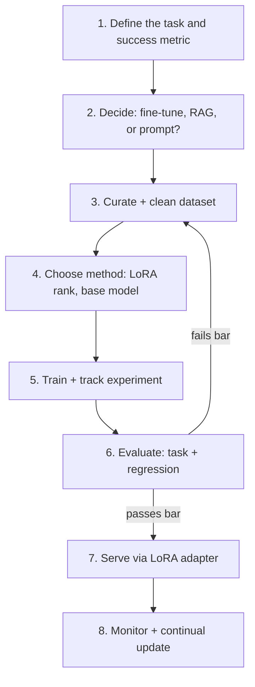

This closes out the Fine-Tuning series by walking one project end to end — a support-ticket triage model — touching every stage covered this month, in the order a real project actually runs.

## The Full Pipeline



## Step 1-2: Task Definition and Approach Decision

Task: classify incoming support tickets into 8 categories and extract urgency, currently done with a brittle keyword-matching system that misclassifies ~30% of tickets. This is a style/pattern problem, not a knowledge problem — the classification heuristic to teach is the target, not any volatile fact — so fine-tuning is the right tool per this month's framework.

```python
success_bar = {"min_accuracy": 0.90, "max_general_regression_pct": 0.03}
```

## Step 3: Dataset Curation

```python
real_examples = load_and_clean(historical_tickets, min_examples_per_category=100)
synthetic_examples = generate_for_gap("ambiguous multi-category tickets", n=150)
deduplicated = near_dedup(exact_dedup(real_examples + synthetic_examples))
balanced = check_category_balance(deduplicated)  # rebalance if any category is underrepresented
train, val, test = split_dataset(balanced, ratios=(0.8, 0.1, 0.1))
```

## Step 4-5: Training

```python
lora_config = LoraConfig(r=16, lora_alpha=32, target_modules=["q_proj", "v_proj"], task_type="CAUSAL_LM")
wandb.init(project="ticket-triage-ft", config={"lora_rank": 16, "learning_rate": 2e-4, "epochs": 3})

trainer = SFTTrainer(
    model=get_peft_model(base_model, lora_config),
    args=SFTConfig(learning_rate=2e-4, num_train_epochs=3, report_to="wandb", eval_strategy="steps"),
    train_dataset=train, eval_dataset=val,
)
trainer.train()
```

## Step 6: Evaluation Against the Pre-Committed Bar

```python
task_results = evaluate_on_task(trainer.model, test)
regression_results = regression_test(base_model, trainer.model, general_benchmark)

ships = (task_results["accuracy"] >= success_bar["min_accuracy"]
          and regression_results["degradation_pct"] <= success_bar["max_general_regression_pct"])
```

## Step 7-8: Serving and Ongoing Monitoring

```python
llm.add_lora(LoRARequest("ticket-triage", 1, "./adapters/ticket-triage-v1"))
# Shadow mode first (April's rollout pattern), then canary, then full rollout

# Ongoing: track accuracy on a rolling window of production tickets with human-corrected labels
weekly_accuracy = evaluate_on_task(current_adapter, get_last_week_corrected_tickets())
if weekly_accuracy["accuracy"] < success_bar["min_accuracy"] - 0.05:
    trigger_continual_update_review()
```

## What This Project Demonstrates

Every individual technique this month — LoRA, dataset curation, evaluation discipline, experiment tracking, adapter serving, continual updates — only becomes valuable assembled into a pipeline like this one, with a pre-committed success bar gating deployment and a monitoring loop feeding back into the next iteration. That discipline, more than any single technique, is what separates fine-tuning projects that ship value from ones that produce an interesting model nobody trusts in production.

## What's Next

June turns from building models to rigorously measuring everything built so far — evaluation frameworks, LLM-as-judge, observability tooling, and the full production monitoring stack this project's Step 8 only sketched.

---

*Part of the [Fine-Tuning series]({{ site.baseurl }}/tags/fine-tuning-series/) — the final post in this series, leading into the [Evaluation, Testing & Observability series]({{ site.baseurl }}/tags/evaluation-series/) starting tomorrow.*
