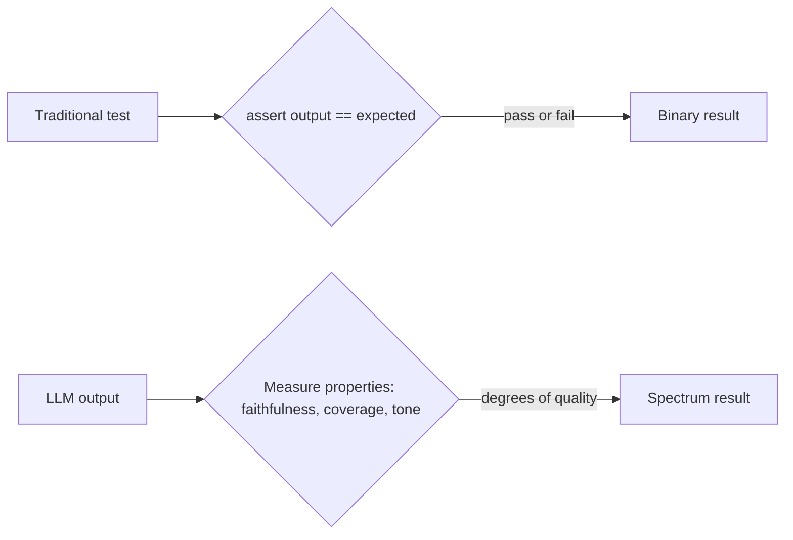

Every fine-tuning post last month leaned on "evaluate against a held-out set" without fully unpacking what that means for LLM systems specifically. June opens by making the difference from traditional software testing explicit, because it changes how you should approach testing from day one, not just for fine-tuned models.



Traditional testing collapses to a single pass/fail bit; LLM evaluation has to score a spectrum of acceptable variation instead. That shift in what "correct" even means is the thread every post this month pulls on.

## Traditional Tests Are Binary; LLM Outputs Are a Spectrum

`assert add(2, 2) == 4` has exactly one correct answer. `assert summarize(article) == ???` doesn't — there are many valid summaries, differing in phrasing, length, and emphasis, that would all be correct. Evaluation has to measure *quality along a spectrum*, not exact match, which is the thread running through the entire month ahead.

## The Same Input Can Produce Different Outputs

Even at temperature 0, model updates, infrastructure changes, or subtle context differences can shift output. A test suite that assumes deterministic outputs from deterministic inputs — the foundation of traditional unit testing — needs to be rebuilt around tolerance, not exact reproduction, echoing the testing-agentic-workflows post from April but applying it to every LLM call, not just agents.

## Failure Isn't Always Visible

A traditional bug throws an exception or produces an obviously wrong value. An LLM failure often looks exactly like success — fluent, confident, plausible text that happens to be subtly wrong, incomplete, or unhelpful. This is the core reason "did it crash" is a useless signal for LLM quality, and why dedicated evaluation infrastructure earns its keep.

## What This Means for How You Build

```python
# Traditional testing mindset — doesn't transfer
def test_summarize():
    assert summarize(article) == expected_summary  # too brittle, will fail on valid variation

# LLM evaluation mindset — measure properties, not exact output
def test_summarize():
    result = summarize(article)
    assert covers_key_points(result, required_points=["revenue", "headcount", "launch_date"])
    assert word_count(result) < 150
    assert not contains_hallucinated_claims(result, source=article)
```

## Four Pillars This Month Builds On

1. **Golden datasets** — a representative, labeled set of inputs and acceptable outputs (tomorrow's post)
2. **Judges** — automated (LLM-as-judge) and human evaluation working together, not as substitutes for each other
3. **Metrics** — task-appropriate measures beyond exact match: faithfulness, relevancy, tone consistency, task success
4. **Observability** — tracing and monitoring that turns "it's slow" or "it seems worse lately" into a specific, diagnosable signal

## Evaluation as a Practice, Not a Phase

The biggest mindset shift: evaluation isn't a gate you pass once before shipping — it's continuous infrastructure that runs on every prompt change, every model update, and every production deploy, feeding back into the whole system the way this month's later posts on regression testing and continuous evaluation cover directly.

---

*Part of the [Evaluation series]({{ site.baseurl }}/tags/evaluation-series/) — following May's [Fine-Tuning series]({{ site.baseurl }}/tags/fine-tuning-series/), where this same discipline was applied specifically to model training.*
