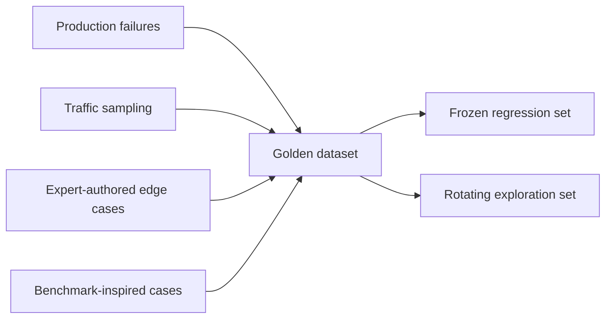

Every evaluation technique this month depends on having a good golden dataset to evaluate against — a curated set of representative inputs paired with what a correct or acceptable output looks like. This is the single highest-leverage investment in an evaluation practice, and it's frequently under-invested in relative to flashier tooling.



Four sourcing strategies feed one dataset, which then splits into two purposes: a frozen regression set that must never fail again, and a rotating exploration set that keeps pace with a shifting production distribution. Keeping that split explicit is what the last section below is about.

## What Goes Into a Golden Example

```python
@dataclass
class GoldenExample:
    input: str
    context: dict | None            # e.g. retrieved docs, conversation history
    acceptable_criteria: list[str]  # not one fixed answer — a checklist of what's required
    category: str                   # for slicing results by scenario type
    difficulty: str                 # easy / medium / hard / adversarial
    source: str                     # where this came from — real traffic, expert-written, edge case
```

The `acceptable_criteria` list, not a single fixed expected output, is what makes this workable for open-ended tasks — "mentions the refund window is 30 days," "does not promise a specific resolution timeline," rather than one exact string a valid response might not match.

## Where Golden Examples Come From

- **Real production failures** — the highest-signal source; every bug report or user complaint is a candidate golden example that should never regress again
- **Representative production traffic sampling** — a random sample of real inputs, not just the failures, to make sure the dataset reflects your actual distribution and not just past incidents
- **Expert-authored edge cases** — deliberately constructed hard cases covering known risk areas (ambiguous phrasing, adversarial input, boundary conditions)
- **Competitor/benchmark-inspired cases** — scenarios drawn from how similar products are evaluated, useful for catching blind spots your own traffic hasn't yet surfaced

## Sizing: Coverage Matters More Than Count

```python
def check_coverage(golden_set: list[GoldenExample], known_categories: list[str]) -> dict:
    counts = Counter(ex.category for ex in golden_set)
    return {cat: counts.get(cat, 0) for cat in known_categories}
```

A golden set of 150 examples with good coverage across every known category and difficulty level is more useful than 1,500 examples clustered around the easy, common case — the same coverage-over-volume principle from May's dataset construction applies directly here.

## Keeping It Alive, Not Frozen

A golden dataset that never grows becomes stale — it stops catching new failure modes as your product and user base evolve. Make adding to it a standing habit tied to your incident process: every production failure that wasn't already covered becomes a new golden example before the incident is closed out.

```python
def add_from_incident(incident: dict, golden_set_path: str):
    new_example = GoldenExample(
        input=incident["user_input"], context=incident.get("context"),
        acceptable_criteria=derive_criteria_from_fix(incident), category=incident["category"],
        difficulty="regression", source=f"incident-{incident['id']}",
    )
    append_to_golden_set(golden_set_path, new_example)
```

## Splitting for Different Purposes

Maintain separate slices: a stable **regression set** (frozen once added — these must never fail again) and a rotating **exploration set** (updated periodically to catch drift in what "representative" traffic even looks like). Conflating the two makes it hard to tell whether a new failure is a genuine regression or expected variance in a shifting distribution.

---

*Part of the [Evaluation series]({{ site.baseurl }}/tags/evaluation-series/) — next: [LLM-as-a-judge]({{ site.baseurl }}/posts/llm-as-a-judge-grading-models/), the most common way to actually score outputs against this golden set at scale.*
