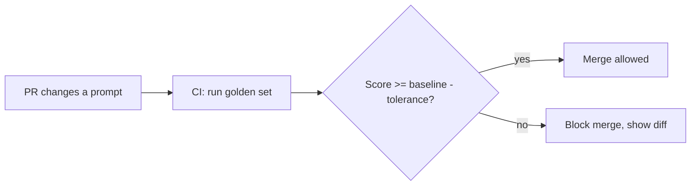

Every evaluation technique this month becomes genuinely valuable once it's wired into CI, catching regressions before a prompt or model change ships — not after users notice.

## The Pipeline



## A Minimal CI Eval Gate

```python
def run_eval_gate(golden_set: list[dict], current_prompt: str, baseline_scores: dict) -> dict:
    results = [
        {"input": ex["input"], "score": judge_response(ex["input"], run_with_prompt(current_prompt, ex["input"]), ex["criteria"])}
        for ex in golden_set
    ]
    current_score = mean(r["score"]["overall_pass"] for r in results)
    regressed = current_score < baseline_scores["overall"] - TOLERANCE
    regressions = [r for r in results if not r["score"]["overall_pass"] and r["input"] in baseline_scores["passing_inputs"]]
    return {"passed": not regressed, "score": current_score, "new_regressions": regressions}
```

Reporting the *specific* newly-failing examples, not just an aggregate score drop, is what makes this actionable in a PR review — "score dropped 3%" tells a reviewer nothing; "these 4 specific golden examples that used to pass now fail, here's why" tells them exactly what to look at.

## GitHub Actions Integration


```yaml
name: Prompt Regression Check
on:
  pull_request:
    paths: ["prompts/**"]

jobs:
  eval:
    runs-on: ubuntu-latest
    steps:
      - uses: actions/checkout@v7
      - run: pip install -r requirements.txt
      - name: Run golden set evaluation
        run: python eval/run_regression_gate.py --baseline eval/baseline_scores.json
        env:
          ANTHROPIC_API_KEY: ${{ secrets.ANTHROPIC_API_KEY }}
      - name: Comment results on PR
        if: always()
        run: python eval/post_pr_comment.py --results eval/results.json
```


This mirrors the RAGAS CI pattern from March's evaluation post, generalized to any prompt change, not just RAG-specific ones.

## Handling Flakiness in a Gate That Blocks Merges

Because model output varies, a single run failing one example shouldn't block a merge outright — apply the pass-rate-over-multiple-runs approach from April's agent testing post specifically to the gate itself:

```python
def stable_gate_result(golden_set, current_prompt, runs=3) -> bool:
    pass_rates = [run_eval_gate(golden_set, current_prompt, baseline)["score"] for _ in range(runs)]
    return median(pass_rates) >= baseline["overall"] - TOLERANCE
```

## Cost Management for CI Evals

Running a full golden set through a judge model on every PR adds real cost and latency to the CI pipeline. Common mitigations: run a smaller, fast subset on every PR and the full set nightly or pre-merge-to-main only, and cache judge results for examples where neither the prompt nor the model changed since the last run.

## Updating the Baseline Deliberately

When a prompt change is an intentional quality improvement, the baseline needs to be updated — but only as an explicit, reviewed step, never automatically on every green run, or the gate silently stops catching the regressions it exists to catch.

---

*Part of the [Evaluation series]({{ site.baseurl }}/tags/evaluation-series/) — next: [A/B testing prompts and models]({{ site.baseurl }}/posts/ab-testing-llm-prompts-models-production/) in production, beyond what a static golden set alone can tell you.*
